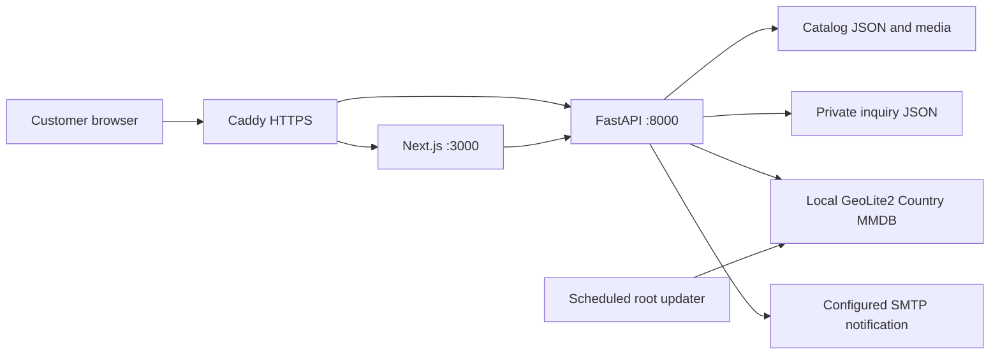
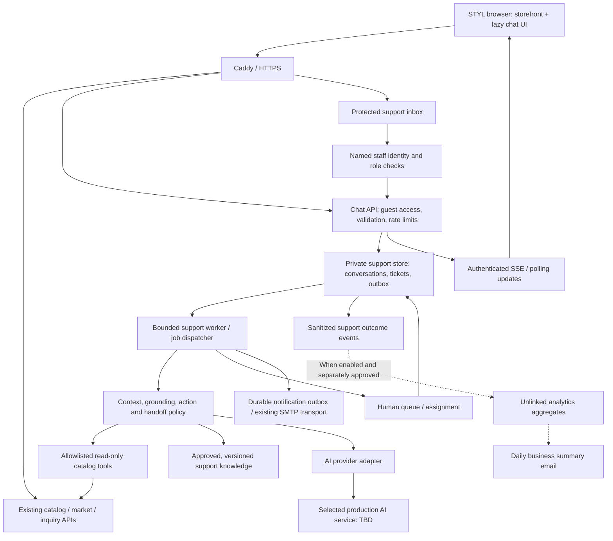
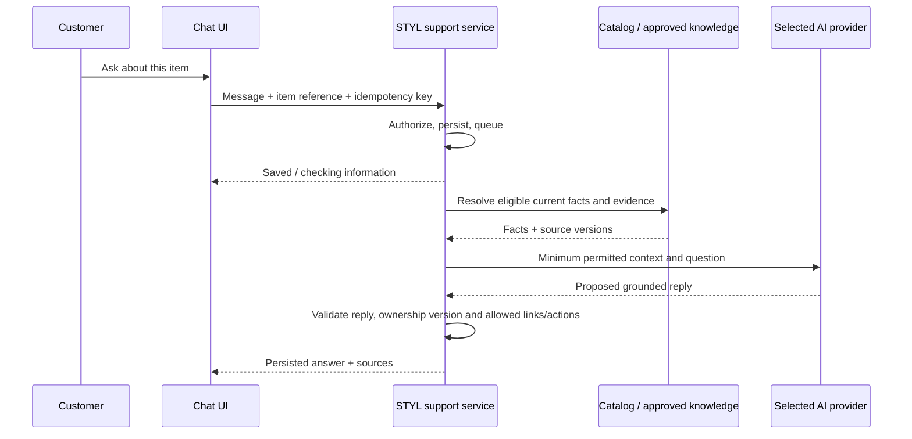

# STYL website and AI-assisted customer-service architecture

Status: Local guest chat, single-operator inbox and scoped provider adapters
implemented. GPT-6 Luna chat/image/PDF checks are verified with synthetic inputs;
Gemini 3.8 Flash video is configured but its live check returned a provider
quota/service-unavailable response. No production push/deployment or billing
configuration change is authorized. See project history for final test evidence.

Date: 2026-09-28

Current source baseline: `d874a8e`; deployed GeoIP/attribution application baseline:
`bc45b22`, plus subsequent operational documentation.

Related documents:

- [Current STYL application](../README.md)
- [Traffic analytics and daily email requirements](traffic-analytics-requirements.md)
- [Current responsive UX](mobile-ux-design.md)
- [Future catalog/admin schema](catalog-and-admin-schema-design.md)
- [Hosting/deployment](lightsail-deployment.md)
- [Country/market selection](geoip-pricing.md)
- [Living regression plan](regression-test-plan.md)
- [Backup & Records policy](records-backup-and-retention.md)

## 2026-10-01 catalog-wide answer accuracy upgrade

The owner approved the accuracy-review plan explicitly for **all equipment,
accessories and public catalog information**, not a Dip-specific compatibility
patch. The Dip example is one regression fixture alongside benches, racks, bars,
cable attachments, straps and trainers. The existing catalog and approved source
library remain authoritative; no generated catalog or screenshot seed is promoted
or written into existing product data.

The implementation introduces a generic per-field answer plan rather than a
single all-or-nothing answer flag. Coverage includes identity/category/brand,
prices/MSRP, colors/finish/material, descriptions/features, dimensions, own weight,
documented load/resistance data, inclusions/selling units/quantities, models/SKUs,
availability/warranty and all published compatibility fields. Missing fields,
conflicts, scope-disabled fields and clarification needs stay distinct. Known
answers survive an unknown field or unrelated pending FAQ; a partial answer can
coexist with a team-attention request.

Published requirements are different from proof of a customer's exact fit.
Direct upright/hole/size questions do not require a customer rack model. Pure
rules can explain a stated requirement match, missing customer measurement or
decisive mismatch, but matching nominal labels does not establish tested fit,
safe load or manufacturing tolerances. No product-specific ID or magic dimension
is used as the generic rule. Own weight is never a safe-load rating or resistance.
Source-stated dual labels remain as stated; unit arithmetic is not fit evidence.

Models may interpret wording into allowed fields/product references and
user-stated measurement spans. Values, comparisons and customer-facing factual
claims come from validated evidence and deterministic rendering. Progress may be
shown, but no unvalidated model facts are streamed. Field-level private traces
record the selected field/status/evidence and published plan, not chain-of-thought.

Clarification state is scoped to its product, intent and captured page context.
A transient page-context version accompanies each new send and is pinned for
retry. A new navigation can prevent reuse of an old pending measurement, but must
not cancel or retarget an already-submitted question. Old chats/contacts remain
business records; this change is not an age-deletion policy or a login requirement.
Only the most recent unanswered clarification can supply pending measurement
slots, within 30 minutes and the same captured page context. A targeted team
reply or an intervening customer question prevents reuse. Expiring this
interpretation context never deletes messages or documents.

Answer-plan traces are retained privately in the existing job records. At
publication, exact rendered text/references/team flags must match a plan
reconstructed from current eligible facts. Mixed catalog/FAQ replies use a
separately validated composite plan and current approved general sources.
Plan data is not returned as customer-facing implementation detail.

Evaluation combines an offline multi-product/field benchmark, live-catalog
read-only consistency checks, API publication/freshness tests and customer DOM
checks for retained known fields. Synthetic approvals are test-only; workflow
test counts are not marketed as a measured real-customer accuracy percentage.

## 2026-10-01 visible document library, general Q&A and item context

The document uploader now uses prominent, site-consistent **Choose file** and
**Upload document** controls. Upload attempts remain clickable when fields are
missing, then show readable inline errors and focus the first invalid field.
Inputs are preserved; invalid attempts do not create a source. A dedicated
**Uploaded documents** library remains visible even when many catalog media
sources exist. It shows title, format, size, original upload time, assignments,
status and whether approved content is actually available to the assistant.
Uploading is not the same as approval; missing/private/stale/ineligible content
is not shown as ready. Readiness uses the same eligibility checks as retrieval.

Two document scopes are supported:

- **Product documents:** assign particular published, priced items.
  **Select all currently published items** captures the current list; it is not
  a wildcard that silently applies to future products. Clear selection is
  available. Assignment changes invalidate prior approval.
- **General customer-service Q&A:** no product assignment is required. Approved
  general policies can answer shipping/delivery, returns, warranty-policy and
  support-process questions without inventing eligibility or commitments.
  Product selling prices remain authoritative live catalog values; a mixed
  product-price assertion cannot be laundered through a service-fee statement.
  Private/contact/credential restrictions remain.

PDF, Word **`.docx`**, UTF-8 **`.txt`** and **`.md`** are accepted. Word processing
extracts text, headings and tables, not a rendered page layout; use PDF/images
for diagrams. External relationships are never fetched, and macros/OLE/unsafe
packages, traversal, duplicate/encrypted/bomb ZIPs and unsafe XML are rejected.
Existing file/page/text bounds fail explicitly rather than truncating successful
imports. All extraction results remain review drafts; original immutable files
and source versions participate in backup/restore.

The new `customer_service` answer topic is visible in Conversations settings.
Schema v3 adds it to the prior default product/pricing/compatibility scope while
preserving the global enabled/disabled choice. Customized narrower topic sets
are retained; the library explains when an approved general document is not
enabled for answering. General knowledge is loaded as a separate read-only
approved snapshot, and its cited source revisions are rechecked before publishing.
No unapproved or newly stale policy answer may escape the publication fence.

Product reference resolution accepts omitted STYL branding, common short names
and conservative alphabetic typo/alias matches. It does not reinterpret explicit
other brands or nearby numeric model/SKU identifiers as STYL items; several
plausible matches produce a clarification rather than a guessed selection.

On verified equipment/accessory detail pages, a compact **About: [item]** chip
shows the default chat context. The item reference is captured when a question
is submitted, including its retry identity, so later navigation cannot retarget
that pending question. An explicitly named product in the question overrides
the page default. General service-policy queries are independent of page context;
unavailable/draft/failed detail pages clear it. On other pages the usual
conversation context remains available.

## 2026-10-01 provider routing and reusable document knowledge

The owner selected the following local routes:

| Work | Provider/model |
| --- | --- |
| Customer chat requiring a model | OpenAI `gpt-6-luna` |
| Image, PDF, DOCX and text/document extraction | OpenAI `gpt-6-luna` |
| Video extraction only | Gemini `gemini-3.8-flash` |
| Unambiguous live catalog price/spec lookup | Trusted local lookup; no model call required |

The exact GPT model is documented at
[GPT-6 Luna](https://developers.openai.com/api/docs/models/gpt-6-luna).
It supports text/image input and structured output, not native video input.
Video processing therefore has an independent provider/model setting, not the
chat model reused accidentally. No automatic provider/model fallback is allowed.
API usage can incur provider charges; configuring a key does not purchase credits,
enable billing, change subscriptions or authorize bulk extraction.

### RAG-style architecture retained by STYL

```text
Published catalog + uploaded documents/media
    -> extraction drafts -> admin review/approval
    -> STYL-owned current knowledge and source references
Customer question -> local retrieval of relevant approved sections
    -> selected model decision -> verified, cited response
```

Raw PDFs, pictures and videos are processed at ingestion, not uploaded again on
each customer question. Current catalog text is read live; approved document facts
and immutable source versions are stored privately in STYL. Existing approved
knowledge remains reusable after changing model providers. New or changed source
facts still require approval. The current retrieval is keyword/section based,
with a compact eligible-item inventory and bounded relevant context; this change
does not introduce embeddings, a vector database or OpenAI-hosted file search.

### Adding more documents

Use **Admin → Customer support → Knowledge → Add documents**. Supply a title,
select product assignments or general Q&A scope, and upload a PDF, DOCX, TXT, MD
or supported media file. Start extraction after acknowledging the selected provider, review
the draft facts/page or timestamp references, then approve. Approved facts become
available to later questions without model retraining or code edits. Uploading
alone does not approve facts or expand allowed answering topics. General policy
topics outside the existing approved scope still require separate approval.
Extraction consent is pinned to the displayed provider/model routing fingerprint.
If routing changes while an admin page is open, the old confirmation is rejected
before enqueueing any files; refresh and explicitly reconfirm the new routing.
Queued jobs also preserve their acknowledged route and pause rather than silently
moving to a different provider after a configuration change.

### Private configuration

`configure-local-ai.ps1 -Provider OpenAI -Action Save` opens a masked prompt and
saves an encrypted `openai-key.dpapi` under the current user's LocalAppData STYL
AI folder. `-Provider Gemini` uses the existing separate `gemini-key.dpapi`.
The legacy Gemini helper remains a wrapper for compatibility. Existing private
directory permissions are validated, not unnecessarily rewritten. No API key
belongs in chat, source, screenshots, frontend variables or backups.

The branch-aware local API starter loads the two keys into the backend process.
The frontend task clears all provider-key environment variables. Active settings:

```dotenv
STYL_SUPPORT_PROVIDER=openai
STYL_SUPPORT_MODEL=gpt-6-luna
STYL_KNOWLEDGE_PROVIDER=openai
STYL_KNOWLEDGE_MODEL=gpt-6-luna
STYL_KNOWLEDGE_VIDEO_PROVIDER=gemini
STYL_KNOWLEDGE_VIDEO_MODEL=gemini-3.8-flash
```

OpenAI Responses requests use `store: false` and validated structured output.
[OpenAI's API data controls](https://developers.openai.com/api/docs/guides/your-data)
state API data is not used for training by default unless the account opts in;
abuse-monitoring retention can still apply. `store: false` is not a claim of zero
retention. Gemini's data terms still apply to acknowledged video processing.
Private follow-up contacts remain outside either provider's prompts.

Use `backend/check_ai.py --provider openai --model gpt-6-luna` only after privately
loading the key in that shell. The check calls the provider decision adapter
directly with synthetic facts so the local price shortcut cannot produce a false
connectivity pass. A model-list/access response alone is not proof of generation
quota, billing readiness or document processing.

## 2026-10-01 clean conversation and private follow-up contacts

The owner requested the display name **STYL Assistant**, removal of the warning
banner and manual **Ask for human help / Refresh conversation** buttons, and
continued composer focus after Enter. Normal chat now uses concise conversational
sentences based on the same verified values/references, rather than field-label
snippets. Complex provider decisions still cannot invent prices, compatibility
or unsupported policy. Failed sends retain their draft/retry identity; minimizing,
navigation or deliberate focus elsewhere must not be reversed by a late response.
Privacy/data-use information remains available through a small Privacy link.

When a question needs the team, retain **Your request has been sent to our team.**
and offer optional **Your name / Email address** fields for follow-up. These are
a separate form/API record, not a chat message or model input. Capturing them does
not require login, block further questions, resolve the question, send an email,
or promise an immediate response. Admin can see the saved contact separately and
use an encoded mailto link. Do not put real personal/confidential information into
unpaid AI chat; the contact form is the private channel for follow-up details.

Guest-only `PUT /api/support/conversations/{id}/contact` saves a trimmed Unicode
name (1–120 characters), a validated single email (up to 254), and an independent
`expectedRevision`. Unknown/other guest tokens cannot read or update it, closed
threads reject changes, stale conflicting edits are explicit, and identical
lost-ack retries do not inflate revisions. Contact updates do not cancel AI jobs
or overwrite newer messages. Contacts never enter model history, message receipts,
traffic analytics or mail-recipient configuration.

Schema v2 keeps `conversation_contacts` separate, linked to the conversation with
explicit cascading removal. Private full SQLite backups include it; closed-thread
cleanup compares those rows too and retains changed contacts. A backup lacking
the current contact schema cannot authorize unsafe cleanup. A protected local
pre-migration snapshot is required before activating the new schema.

The daily analytics report is now scheduled for **00:15 Pacific the next day**,
not 08:00. It covers the previous completed calendar day, retains DST/date-window
and per-recipient duplicate protections, and does not change recipient enablement
or send real email in local/test. Production timing changes require a separately
approved deployment.

## 2026-09-30 question-based collaborative replies

The owner explicitly chose collaboration instead of conversation takeover:
the assistant continues answering new questions while team members reply to
individual earlier questions. The selected-conversation controls are **Reply**
and **Close conversation**, not takeover/resume/clear-request mode controls.
Global automatic-answer settings, source/scope safeguards and closed-state
protection still apply. Legacy open `human` threads no longer represent exclusive
ownership; they can receive new assistant answers without manual resumption.

Each customer question carries its own pending-team status and answered-by link.
The admin transcript highlights **Needs a team reply**, with a Reply action on
the question. A reply pins the original question, previews its quote, and sends
that exact same-conversation customer-message identity. Team replies display the
quote in both customer and admin chat. Sending a reply clears only the target
question; other unresolved questions remain highlighted and counted. Existing
unlinked historical team messages are not retroactively assigned guessed quotes.

The composer uses **Your reply**, **Write a helpful message…**, and **Send reply**.
Draft text, chosen question and its concurrency precondition survive polling,
navigation and recoverable errors. New unrelated customer/assistant activity
must not retarget a draft or make it impossible to send: target-level
`expectedAnsweredBy` checks protect against a competing team answer, while
message ID/text/target define idempotency. No client-supplied quote text is trusted.
If a refreshed question has a different answer than the draft captured, sending
remains blocked until **Review latest answer and continue** is explicitly
confirmed. That confirmation updates only the question precondition, preserving
the draft, target and retry UUID; ordinary refresh is not permission to override
a competing answer.

Replying to an older question leaves the latest AI job untouched. If the team
answers the very question currently being processed, only that question's AI job
is cancelled to avoid a duplicate response; future questions remain eligible.
Closing the conversation still fences outstanding work. Follow-up item resolution
prioritizes the customer's most recent explicit item, not a late team response
that quotes a different, older product question.

Private SQLite migration adds question/reply metadata without deleting records;
quotes and resolution links participate in existing complete support backups.
Legacy failed-job questions are conservatively identified for review rather than
pretending an unlinked old team reply resolved a specific question. Customer
payloads omit internal question-reason codes; admin retains diagnostic evidence.

## 2026-09-30 professional wording and continued assistance

Customer-facing identity is **STYL Assistant**, with **STYL team** for actual
human replies. The saved handoff confirmation is only:
**"Your request has been sent to our team."** It does not claim that a person is
online, that email was delivered, or that a response deadline exists. Diagnostic
reason codes remain in authenticated admin views; guest views return no reason.
Known historical pause messages are normalized for customer presentation without
rewriting the stored transcript. Necessary unpaid-provider privacy information is
available through concise preview/privacy details, not repeated implementation
explanations in the ordinary conversation.

A **pending human request does not pause the assistant**. Customers can ask new
questions; answers retain the outstanding human-attention flag and its admin
reason. Repeated requests are idempotent and do not interrupt acknowledged work.
The later question-based collaboration decision above supersedes takeover and
resume controls. Closure, disabled automatic assistance or an answer to the
same current question can fence relevant work; an unrelated team reply cannot.
Existing waiting conversations use this behavior on their next message, without
rewriting history or automatically replaying old questions.

Read-only local diagnosis established that provider failures were followed by
the old waiting state suppressing later catalog jobs. Straightforward, unambiguous
catalog lookups now use verified current public facts directly before requesting
Gemini: prices, weights/specifications, explicitly stated STYL branding, basic
overviews and catalog listings. Price values never come from prior human/model
messages. Exact/current item references and conservative unique-name matching
resolve follow-ups such as "what is the weight of it"; ambiguous names ask for
clarification rather than picking a similar item. Missing facts still request
human help, without exposing technical reasons.

More complex questions retain the provider/evidence workflow, so upstream service
availability is not claimed fixed. A clean follow-up is not permanently blocked
because an earlier message contained contact information: obvious sensitive prior
messages are omitted from provider context, while current sensitive input still
does not go to Gemini. This is not comprehensive DLP; local free-tier tests remain
synthetic/non-sensitive.

## 2026-09-30 floating chat and reviewed knowledge expansion

The owner approved local development on the AI branch after clarifying:

- Persistent bottom-right avatar on customer pages. Open a compact bottom-right
  chat dialog; on phones it is nearly full width but leaves some storefront
  visible. Customer bubbles are **left**, AI/human bubbles **right**, with
  responder labels. Minimize without losing the conversation or draft across
  navigation. Animate only during a real pending AI response, respect reduced
  motion, show unread replies and do not auto-open unsolicited conversations.
- Keep the page-style Customer Support admin workspace, adding central knowledge
  upload/product assignment and draft review there.
- Search **complete** published catalog text and every feature, not truncated
  first paragraphs or eight-item-only context. Refresh live prices and visibility
  per turn. The entire eligible item inventory is available; relevant complete
  text sections are retrieved from the full source before bounding model context.
- Reuse catalog images/videos and accept centrally uploaded manuals/documents.
  Extract media/document facts into drafts; none become customer knowledge until
  explicitly approved. Quote approved facts with their source/page/timestamp.
  Changed/removed source material or assignments invalidate approval.
- Consolidate catalog recovery and business/log/support records under one Backup
  tab. Short contextual guidance and expandable details replace repeated warning
  blocks; failures, downloaded-file verification and destructive confirmations
  remain explicit and mandatory.

This is still local/test only, text chat only, with no paid upgrade, production
push/deployment, customer accounts or voice features. Free-tier extraction is
started explicitly for approved, non-sensitive source material. Quota/service
failures must remain visible, resumable and bounded rather than pretending
extraction succeeded or switching to a paid provider.

Published product-specific warranty text is part of catalog facts; quoting it
does not decide a customer's warranty eligibility or authorize a refund.
Shipping/return/refund policies without approved scope remain human work.
Media analysis is not a guarantee of correct fit/load/safety: every derived fact
is an admin-reviewed draft, and missing evidence still requires human help.

Knowledge source copies are private, immutable, content-addressed files. The
support database stores their assignments, extracted versions and approval state.
Both database and source versions participate in private records backup/restore;
closed-conversation cleanup must not remove the knowledge library.

### Using the central knowledge workflow

Open **Admin → Customer support → Knowledge**:

1. **Sync catalog media** discovers eligible equipment/accessory images and videos,
   preserving private content-addressed copies and historical versions. Complete
   public catalog text is already live and requires no second upload.
2. Upload a manual/document with a title and one or more published product
   assignments. Sources are private attachments, not publicly served executable
   documents.
3. Confirm the material is approved public/non-sensitive information, then choose
   **Extract draft** or **Extract pending**. This is the explicit boundary before
   files are sent to Gemini; sync/upload alone does not call the model.
4. Review every extracted draft, its page/timestamp/region and assigned products.
   Edit or reject unsupported/private/price claims. Only **Approve** publishes
   current facts to the customer AI. Changed sources/assignments require review
   again; an item deleted and replaced under the same numeric ID cannot inherit
   its old approved manual.

Current upload/processing bounds are exposed in the UI: PDF 25 MiB/100 pages,
images 8 MiB, videos 50 MiB/10 minutes; at most 1,000 sources/2 GiB source storage.
Oversized, encrypted, malformed or unreadable sources fail explicitly; no
successful first-N-page import is substituted for the complete document.
All native PDF text is split into reviewable page/paragraph chunks, alongside
visual extraction drafts. Native and visual chunks may overlap and need review.
JPEG/PNG/WebP, PDFs and supported videos have automated extraction. SVG/GIF sources
are retained but currently require conversion to a supported raster format before
extraction; this limitation is shown as an error, not silently skipped.

Quota/service errors pause the attempted source and establish a persistent
provider/model cooldown. Subsequent sources remain queued, rather than repeatedly
uploading files during the same restriction. Retry the failed source explicitly
after the displayed time; interrupted work also becomes a visible paused state.
Known uploaded provider files are deleted after processing, with failed cleanup
identities retained for bounded retry. This does not erase provider safety logs
or supersede the unpaid-service data terms.

`STYL_KNOWLEDGE_DIR` defaults to `knowledge` beside `STYL_SUPPORT_DB`. It must remain
private and outside public uploads. Records ZIPs include its immutable source
versions and database references; missing or content-hash-mismatched sources
prevent a misleading complete backup.

## 2026-09-29 local implementation request and readiness

The owner requested customer text chat, a consolidated admin inbox with separate
conversations for different customers, clearly highlighted human-intervention
cases, and AI answers constrained by an approved, expandable scope (initially
product information and evidenced compatibility). Gemini is the preferred first
provider to evaluate, with provider/model replacement supported without rebuilding
the chat UI, conversation store or business rules. Finish log-backup work first;
development and testing remain local, with no production push/deployment.

The prior MUSE/CoWork discussion is historical, not the selected integration.
The broader design below remains a proposal unless covered by this confirmed
direction. Confirmed: guest chat now with future guest/account coexistence;
existing admin sign-in for this single-operator local pilot; initial configurable
topics are published product facts, current selected-market prices and explicitly
documented compatibility. Missing evidence, excluded topics and customer requests
go to human help. Named/revocable staff identities remain a multi-agent public
release requirement. The current English UI/response templates do not constitute
multilingual certification or a production response-time promise.

### Gemini prerequisites verified from official documentation

Checked 2026-09-29; these are service documentation facts, not an account inspection:

- [Google AI plans](https://ai.google.dev/gemini-api/docs/google-ai-plans):
  subscription development benefits apply to the AI Studio web interface.
  Direct Gemini API use by STYL is separately billed/managed. Eligible Developer
  Program Cloud credits may apply after Cloud Billing setup; Google One AI
  credits are a different system. No credit entitlement/balance is assumed.
- [API keys](https://ai.google.dev/gemini-api/docs/api-key): a Gemini API key is
  associated with a Google Cloud project. New AI Studio keys are authorization
  keys by default; unrestricted standard keys are rejected. Keys remain backend
  only and must never enter browser bundles, chat, screenshots or Git.
- [Billing](https://ai.google.dev/gemini-api/docs/billing): select models support
  free-tier testing; paid-tier access requires linked Cloud Billing and may
  require a minimum prepayment. Do not activate billing, auto-reload or a purchase
  without owner approval. Subscription quotas are not the website's API budget.
- [Terms](https://ai.google.dev/gemini-api/terms): unpaid input/output may be
  used to improve Google's services and reviewed by people; do not submit
  sensitive, confidential or personal information. Paid services do not use
  prompts/responses for product improvement, but limited abuse-monitoring/legal
  retention still applies. Paid is not zero retention. Review age, regional and
  customer-facing use restrictions before any public rollout.

### Access checklist before a real connection test

- Confirm an AI Studio/Cloud project and project identifier under the intended
  Google account; do not assume the Google One subscription created one.
- Confirm the project's billing tier, credit availability and an approved test
  spending limit. Synthetic/non-sensitive messages only for local tests.
- Have the owner place a restricted API key in a private local secret store
  outside Git/OneDrive. Record only configured/not-configured status, never its
  value. Do not ask the owner to paste a key or password into chat.
- Select an API model actually available to that project. Keep provider/model
  configurable server-side; do not bind business policy to a hard-coded Gemini
  UI product name or consumer account session.
- Verify authentication/model availability, one bounded synthetic generation,
  timeout/quota failures and usage accounting without printing credentials.
- Verified: the owner-created **STYL chatbot** project
  (`gen-lang-client-0774748468`) shows **Free tier**. The owner entered the key
  through a masked local terminal; it is encrypted with Windows-user DPAPI under
  `%LOCALAPPDATA%\STYL\AI\gemini-key.dpapi`, outside Git/OneDrive. No full key was
  sent in chat or committed. Model listing authenticated successfully.
- A small `gemini-3.8-flash` connectivity call returned the expected synthetic
  acknowledgement, but subsequent structured support calls returned HTTP 503.
  A listed `gemini-2.5-flash` alternative returned 404. Actual structured support
  with **`gemini-3.5-flash`** succeeded: synthetic CAD price and source reference
  were correctly rendered, with 802 total tokens reported. The local default is
  therefore `gemini-3.5-flash`, explicitly configurable rather than silently
  switching models on failure. Listing alone is not inference-availability proof.
- No billing was enabled, no automatic paid fallback exists, and live checks
  used only synthetic non-sensitive content. Free-tier limits/service
  availability can change; quota/errors persist a human-help outcome.

Support transcripts, settings and queue history are business records under the
new no-age-expiry policy. Their separate SQLite store must join the private
backup/restore workflow before the chat feature is declared complete. Explicit
privacy deletion remains separate; chat must not create identified traffic
analytics or transmit private catalog provenance to an AI provider.

### Implemented local pilot versus the broader proposal

- Original pilot `/support`: opt-in guest conversation start, browser-token resume, scoped
  messages, current state and sources, explicit human-help button. No intrusive
  popup; the approved floating-widget enhancement above supersedes the original
  dedicated-page presentation while retaining guest access and messages.
- Admin **Support inbox**: separate guest threads, attention count/highlights,
  question-linked team replies and close. The earlier takeover/resume controls
  were removed by the later collaborative-reply decision.
  Configurable automatic replies and topic checkboxes; provider/model/credential
  readiness is visible but keys never appear in the UI.
- Private SQLite conversations/messages/jobs/settings, one bounded in-process
  worker, scoped request idempotency and compare-and-swap revisions. Provider
  calls happen outside database transactions. Guest tokens are stored only as
  hashes on the server. Future account ownership can be added at the access
  boundary; there is no customer account system or cross-device recovery yet.
- Catalog evidence is refreshed before inference and rechecked before publishing;
  drafts, missing-market items and changed prices/details cannot produce stale
  queued answers. Same-question team answers, close/settings changes fence
  relevant late AI publication, without interrupting newer unrelated questions.
- Gemini returns a constrained topic/reference/field decision, **not unrestricted
  factual prose**. Trusted code renders published values and exact currency
  amounts, or flags missing/unverified compatibility for a human. This intentionally
  conservative first version favors evidence over conversational elaboration.
- Public fact fields are allowlisted; no tools, arbitrary URL fetches, private
  provenance, admin credentials or other customer records are available to AI.
  Obvious email/phone/URL input is kept away from the provider, but that heuristic
  is not comprehensive personal-data detection. Synthetic-only local use remains
  mandatory with the unpaid provider.
- Support SQLite is included in Backup & Records. Optional cleanup only removes
  complete, unchanged, closed threads and their children from a verified archive;
  active/changed/pending work and current settings remain.
- No automatic expiry, named staff login, email notification/outbox, customer
  file/voice upload, arbitrary FAQ authoring, analytics correlation, or production enablement
  was added. Those broader sections below remain future design.

### Local configuration and verification commands

`STYL_SUPPORT_ENABLED` defaults false. Even when true, this pilot refuses feature
use outside `local`/`test`; do not change a production analytics environment to
circumvent that restriction. Provider defaults `gemini`, model defaults
`gemini-3.5-flash`. `STYL_SUPPORT_DB` must be a separate absolute private SQLite
path, defaulting beside the analytics database. `mock` is for isolated local/tests.
The current local API task loads the private key and uses
`%LOCALAPPDATA%\STYL\AI\support.sqlite3`; SMTP remains disabled.

```powershell
# Save through a masked prompt (no API call or billing change):
.\configure-local-gemini.ps1 -Action Save
# Use -Replace only for intentional key replacement.
.\configure-local-gemini.ps1 -Action Status

# A new shell must load the key privately before a synthetic live check:
.\configure-local-gemini.ps1 -Action Load
.\.venv\Scripts\python.exe backend\check_gemini.py --model gemini-3.5-flash --support
```

The helper decrypts only into the current process environment; launch only the
backend from that shell, not a frontend build. The `NEXT_PUBLIC_*` namespace must
never contain an API key. Model changes use server configuration and restart, not
provider-specific UI changes. Another provider implements the small
`Provider.decide` protocol and adapter registry; policy, storage and UI stay owned
by STYL. Configuration alone cannot magically support an unimplemented provider.

Automated verification uses isolated temporary databases/catalogs, `mock`, empty
provider-key environment variables and mocked HTTP transports. Real Gemini
synthetic checks are reported separately, never as production customer-readiness.

### Switching between the deployed baseline and AI development

The owner requested separate branches on 2026-09-30:

- `main`: deployed application `d6d00a3`, plus documentation-only deployment record
  `b903f1c`. The application/deployment files in these commits are identical.
- `ai-assistant/baseline-2026-09-29-2227-pt`: the undeployed AI pilot and its
  Backup & Records/log-retention dependency. The name records the production
  baseline activation, **2026-09-29 22:27 Pacific** (`2026-09-30T05:27:30Z`),
  not a claim that this experimental work is deployed.

Stop the two local STYL tasks before changing branches, inspect `git status`,
then use either:

```powershell
git switch main
git switch ai-assistant/baseline-2026-09-29-2227-pt
```

Run only the switch for the branch you want, then restart **STYL: local API**
and **STYL: local web**. The existing ignored local starter checks whether the
support module and private-key loader exist on the selected branch. On `main`
it disables support and does not load Gemini credentials; on the AI branch it
uses the existing encrypted key and private support database.

Git switching does not migrate or delete local data. The selected private catalog
mirror, chat/analytics databases and DPAPI key remain outside Git. Original
uncommitted catalog JSON edits are intentionally excluded from the AI commit;
do not overwrite them or indiscriminately stage/stash all files. If future branch
changes conflict with those edits, resolve that explicitly rather than forcing
checkout. Branch switching itself never pushes, deploys or changes billing.

## 1. Executive recommendation

Add a first-party customer chat experience to STYL, backed by a server-controlled
support service. Use an AI-provider adapter so the implementation is not tied to
MUSE, CoWork or another candidate before evaluation.

The AI should answer routine questions using approved STYL information and
current public catalog facts. It should not guess when it lacks context. A
durable human-support queue is part of the first customer-facing release,
not a later substitute for failed AI responses.

Recommended approach:

1. Define support policies, approved knowledge and human ownership first.
2. Establish reliable human contact/handoff and named staff access.
3. Add read-only, grounded AI assistance behind a feature flag.
4. Pilot and evaluate answer quality, escalation and privacy before broad rollout.
5. Integrate aggregate support outcomes with the future analytics/dashboard and
   daily email without copying transcripts into analytics.

Keep the existing catalog, prices, cart and quote flow operational if chat,
its provider or its database is unavailable. Do not run a large language model
on the current small Lightsail instance, and do not make production chat depend
on an open VS Code session, desktop automation or an operator's personal login.

## 2. Scope and decisions

### User-confirmed direction

- Near-future live chat for customer questions.
- AI normally responds; human fallback when the AI lacks sufficient context.
- Gemini free tier is selected for synthetic local testing, with the verified
  `gemini-3.5-flash` model; paid/customer production use remains unapproved.
- Architecture must include the current website, UX, prerequisites and overall design.

### Proposed first release

- Text chat on public desktop/mobile pages; explicitly labelled AI assistance.
- Contextual questions about an item, general policies and an optional shared cart.
- Approved FAQ/policy retrieval and live public catalog tools.
- Human handoff, offline follow-up, support inbox, assignment and notifications.
- Conversation recovery, abuse/cost controls, privacy notice and retention.
- Basic support health/quality metrics; optional aggregate analytics integration.

### Not in the first release

- AI changing catalog data, prices, publication status, stock or compatibility.
- Autonomous discounts, binding quotes, purchases, refunds or payment handling.
- Customer order/account lookup without a separately designed identity check.
- General browsing of arbitrary customer-supplied URLs or autonomous desktop work.
- Customer image/file uploads, voice, social-channel chat or screen sharing.
- Unrestricted training/medical/rehabilitation advice or invented load/fit claims.
- Automatic learning from every chat or human response.
- Replacing the broader catalog model or completing the analytics project as a
  prerequisite for launching support.

All schedules, budgets, retention periods and performance limits in this draft
are proposed defaults requiring review, not existing service promises.

## 3. Current STYL: what exists today

| Component | Current capability | Implication for chat |
| --- | --- | --- |
| Next.js/React/TypeScript frontend | Home/product collection, accessories, product details, cart, quote form and admin | Integrate a shared public-site launcher without disrupting these journeys |
| FastAPI | Public catalog/market/selection, protected admin writes, uploads and inquiry receipt | Reuse domain validation, not an admin credential inside an AI tool |
| Catalog persistence | Separate product/accessory JSON and uploaded media on disk | Current item type + immutable ID is the integration key; no dependency on future global SKUs |
| Pricing/publication | Independent CAD/USD, country-based market, missing-market hiding, draft exclusion | AI answers must respect the same visibility and price semantics |
| GeoIP | Local Country MMDB with scheduled production updates | Pass only necessary country/currency context; not raw IP or an inferred delivery address |
| Cart | Browser-local selected items/quantities reconciled with the current catalog | Share with chat only through an explicit action and server revalidation |
| Inquiries | Save request JSON before SMTP; customer email is Reply-To | Existing inquiry endpoint is not a support conversation, agent inbox or delivery/read receipt |
| Admin access | Shared bearer-token access | Not sufficient for accountable multi-agent support; named identities/roles are a prerequisite |
| Hosting | One AWS Lightsail Ubuntu instance, Caddy HTTPS, frontend :3000 and API :8000 on loopback | Start small; isolate AI work and bound load so the storefront remains responsive |
| Traffic analytics | Aggregate-only collection deployed in a611b4e; real daily email disabled | Future support may supply optional unlinked aggregate counts only; no browser/session/conversation correlation in traffic analytics |
| AI/live support | Local/test guest chat, Gemini adapter and single-operator inbox implemented | Not deployed; no production staffing schedule/SLA, account login or arbitrary knowledge-base authoring; see local pilot scope above |

Current source references:
[API and inquiry handling](../backend/app/main.py),
[country resolver](../backend/app/location.py),
[root layout](../frontend/src/app/layout.tsx),
[store header](../frontend/src/components/StoreHeader.tsx),
[cart logic](../frontend/src/lib/useCart.ts).

### Current deployment diagram



The diagram is logical. Browser API calls use same-origin routing in production;
ports 3000/8000 must not be opened publicly to support chat.

## 4. Prerequisites and readiness gates

| Gate | Needed before | Required owner/input and exit condition |
| --- | --- | --- |
| PR-01: support scope | AI pilot | Business owner approves supported topics, prohibited promises, escalation reasons and initial language(s) |
| PR-02: human service | Public chat | Named people, support hours/timezone/holidays, backup coverage, queue ownership and achievable response target |
| PR-03: knowledge readiness | AI answers | Reviewed product facts, compatibility evidence and shipping/installation/warranty/returns FAQs with owner/version/effective dates |
| PR-04: provider eligibility | Any external AI request | Exact product/vendor identified; production API/SDK, data-processing terms, retention/training controls, region, deletion and cost evaluated |
| PR-05: privacy and consent | Collecting chats | Customer notice, processing basis/consent model, transcript/contact retention, human/provider sharing and deletion process approved |
| PR-06: staff identity | Human inbox | Named authentication, operator permissions, audit trail and ability to revoke access; no shared catalog token as an agent login |
| PR-07: durable storage | Handoff pilot | Conversations, ownership, ticket state and notifications survive restart; tested backup/restore and deletion |
| PR-08: operations | Production rollout | Secrets, rate/cost limits, monitoring, fallback, feature flags, rollback and operator runbook verified |
| PR-09: evaluation set | AI pilot | Owner-reviewed common questions, missing/conflicting-data examples and unsafe/private-data requests with expected outcomes |
| PR-10: customer fallback | Any public release | A working human/offline route is visible even if the AI provider, stream or widget fails |

Important unanswered business content is not something the model should invent.
Examples to prepare: delivery coverage, freight/installation process, lead-time
policy, returns, warranty applicability, assembly/manual links, support contact,
business hours, and evidence for model-specific fit/load claims.

An email notification mailbox alone does not establish staffed live support.
If no operator is available, launch as "AI help + contact the team", not as
guaranteed live human chat.

## 5. Future logical architecture



### Component responsibilities

- **Chat UI:** render messages/status, collect deliberate customer input and
  selected context, resume authorized conversations, expose human/quote actions.
- **Chat API:** own authentication, conversation access, idempotency, current
  market resolution, message validation, durable state and authorized events.
- **Support worker:** make bounded provider calls outside catalog request paths;
  never hold a database transaction while waiting for a model/network.
- **Grounding/policy layer:** select approved evidence, constrain tools, validate
  answer/action contracts and decide when to clarify or hand off.
- **Provider adapter:** isolate provider SDK, model/version configuration,
  deadlines, cancellation, usage and error mapping. It does not own business policy.
- **Knowledge store:** approved business documents and publication metadata,
  distinct from arbitrary repository files or customer transcripts.
- **Support inbox:** assignments, full authorized context, replies, handoff state
  and staff audit; no dependency on the owner keeping this chat session open.
- **Notification worker:** persist notifications and delivery status; a failed
  email does not lose a handoff ticket.
- **Analytics adapter:** emit allowed counts/outcomes only. It must be safe to
  disable without disabling customer support.

### Initial infrastructure recommendation

Keep the current frontend/API and catalog JSON. Add a separate private SQLite
support database with transactions, uniqueness constraints, WAL-aware backups
and bounded lock waits. A small dedicated worker can use durable jobs/outbox
tables in that database; Redis, a vector service and a new managed database are
not mandatory for the first release.

Use an approved external production AI API for inference. The current 1 GB
Lightsail server is not a target for hosting a large model. Prefer curated text
search/SQLite full-text search for a small FAQ corpus initially; introduce
embeddings/vector retrieval only if evaluation shows a need.

Bound worker concurrency and queue length, and measure memory/CPU/latency with
the storefront under load. Move the worker/storage to separate infrastructure
when measurements justify it. Do not add multiple catalog-writing API workers
or multi-server writes to the current JSON catalog as a side effect of chat.

## 6. Grounding and safe AI behavior

### Knowledge sources and trust

| Source | Use | Restrictions |
| --- | --- | --- |
| Current public catalog/market services | Price, selling unit, published specifications, eligible items | Fetch structured current facts; enforce current market and publication rules on every turn |
| Approved STYL FAQ/policies/manual excerpts | General service/product guidance | Published, versioned, applicable, reviewed and within expiry; cite the relevant source |
| Customer's explicit chat input | Question and stated requirements | Untrusted data, not instructions to override policy or obtain privileged tools |
| Customer-shared item/cart references | Context for the question | Re-resolve IDs and prices server-side; never trust client prices/status |
| Staff-only support notes | Authorized human work | Excluded from customer AI retrieval unless separately reviewed/published |
| Private provenance, credentials, admin files, other customers' inquiries | None | Never indexed or passed to the model |
| Arbitrary external URLs or uploaded documents | None in MVP | No autonomous fetch/ingestion from customer instructions |

RAG means retrieving approved evidence to support a response; it is not a
guarantee that a model will be correct. Retrieved text can contain malicious
instructions too. Treat all retrieved/customer text as data, restrict tool
capabilities server-side and validate outputs independently of the prompt.

### Response decision

1. Resolve the customer question and explicit item/context references.
2. Obtain current market-eligible public facts and applicable knowledge.
3. If the question is ambiguous, ask a concise clarification; proposed maximum
   two unsuccessful clarification turns before handoff.
4. If evidence is missing, stale, contradictory, out of scope or insufficient
   for a safe answer, explain the gap and start the human fallback flow.
5. Otherwise generate a short answer with source links/identifiers, then validate
   item references, amounts, currency and permitted actions before publication.

Do not use the model's self-reported confidence as the sole handoff gate.
Use evidence sufficiency, topic risk, tool outcomes and evaluated thresholds.

### Non-negotiable business rules

- Never fabricate stock, delivery dates, installation coverage, discounts,
  warranty entitlement, certifications or final shipping/tax amounts.
- Live catalog data is authoritative for displayed prices; cached embeddings or
  previous chat turns cannot override it. CAD/USD stay separate.
- An item hidden for the current market or in Draft cannot be disclosed through
  chat search, comparison, citations, recommendations or tool output.
- Do not infer compatibility from category or nominal dimensions. **75 mm is
  not exactly 3 inches (76.2 mm)**; unsupported model-specific fit/load questions
  go to the team rather than receiving a confident guess.
- Quotes are requests, not purchases or binding offers. Direct customers to the
  existing quote flow and let them review anything proposed for submission.
- No admin token, production shell, generic SQL, arbitrary HTTP fetch, payment,
  catalog-write or customer-record-search tool is available to the customer AI.
- The model may propose a handoff; application policy persists and authorizes it.
- Human corrections become knowledge drafts for review, not automatically
  published training material or shared memory across customers.

For MVP, send progress/status events while preparing an answer, but buffer and
validate the complete answer before publishing it. Token-by-token answer
streaming is optional later; it must not expose unvalidated prices or unsafe
claims that cannot be meaningfully retracted.

## 7. Human fallback and conversation ownership

### Handoff triggers

- Customer explicitly requests a person, at any time.
- Insufficient/conflicting/outdated evidence or an unsupported question.
- Specific compatibility/load/warranty/exception questions needing confirmation.
- Requested commercial negotiation, custom delivery or other binding decision.
- Repeated misunderstandings, negative feedback or provider/tool failure.
- Abuse/security handling or a topic outside the approved support scope.

The initial notice must clearly explain AI assistance and possible review by
the STYL team. The final privacy design determines when additional confirmation
is needed before forwarding a transcript, especially to an external helpdesk.

### State model

| State | Customer sees | Allowed responder |
| --- | --- | --- |
| `ai` | STYL assistant and grounded replies | Policy-controlled assistant |
| `waiting_human` | Your request has been sent to our team | Assistant remains available; pending human attention is retained |
| Legacy `human` | STYL assistant remains available | Open legacy threads participate in question-based collaboration |
| `waiting_customer` | Team needs a clarification | Human remains owner |
| `resolved` | Resolution and optional feedback | No new answer until explicit reopen |
| `closed` | Read-only history where retained | None; new/reopened request follows a defined route |

Provider failures are recorded on the relevant question. They do not change
collaborative eligibility; explicit close and global settings remain authoritative.

### Handoff requirements

- Persist the human request before displaying "Your request has been sent to our team."
- Save reason code, item references, market, last question, available source
  references and the authorized transcript. A machine-generated summary must be
  labelled and must not replace the transcript as the evidence.
- Assignment/claim is transactional. Two staff members cannot unknowingly claim
  the same conversation. Audit who claimed, transferred, replied and resolved it.
- Team replies target a particular customer question. The quote is resolved
  server-side within that conversation, never accepted as arbitrary client text.
- A team answer cancels only an outstanding AI job for that same question.
  Replies to older questions do not cancel the latest job or require AI resume.
- Requesting human help marks the relevant question but does not stop assistance.
  Per-question resolution drives pending counts; closing the thread fences work.
- Presence combines staffed hours, assignment/capacity and recent staff heartbeat.
  A configured schedule alone does not justify "A person is online."
- Outside coverage, say the team is offline and offer follow-up. Ask for a contact
  address only when needed; show the configured response target without inventing
  an exact wait time or guaranteeing immediate service.
- A browser close does not erase a saved queue ticket. Provide an authorized
  resume method; email follow-up is separate from an in-browser delivery receipt.

If the support database cannot save a handoff, say it was **not saved** and show
the existing contact/quote route. SMTP acceptance, ticket creation, agent
assignment and a human response are four different states.

## 8. Customer UX

### Launcher and contextual entry

- Use a small, clearly labelled **Ask STYL** launcher, not an intrusive auto-open
  popup. No unsolicited fake "agent typing" messages or repeated attention sounds.
- Place a contextual "Ask about this item" action on detail pages and optionally
  cards after layout review. Pass item type/ID, not the full DOM.
- On the cart, offer "Ask about my selection" with a clear share-selection action.
  Do not silently scrape browser storage or quote fields into chat.
- Show the current item/market as removable context chips inside chat. Changing
  an item or leaving a page must not silently replace a question's context.
- Keep the primary shopping/quote actions visually dominant.

### Desktop wireframe

```text
Catalog / product page                       +------------------------------+
                                            | Ask STYL                  [-]|
Existing details and actions remain usable   | AI assistant | Talk to team  |
                                            | About: [Selected item x]     |
                                            | Prices: USD                  |
                                            |------------------------------|
                                            | Customer question            |
                                            | AI answer with source link   |
                                            | [View item] [Request quote]  |
                                            |------------------------------|
                                            | Message...             [Send]|
                                            | AI can make mistakes. Privacy|
                                            +------------------------------+
```

Proposed width: 360-420 CSS px with a responsive maximum; height limited to the
visible viewport. It must not cover the active quote form or important cart
controls. Allow minimize/close without losing an already saved conversation.

### Mobile wireframe and collision rules

```text
+----------------------------------+
| Back   Ask STYL             Close |
| AI assistant / STYL team member   |
| [Item context] [USD]              |
|----------------------------------|
| Message history                  |
| Grounded reply / human status    |
|                                  |
|----------------------------------|
| Message...                 Send  |
| Privacy / contact fallback       |
+----------------------------------+
```

- Use a full-height sheet or dedicated support route on narrow phones rather
  than shrinking a desktop panel. Respect dynamic viewport height and safe areas.
- The software keyboard must not cover the composer or Send; keep a reachable
  Close/Back control. Browser back closes the sheet before unexpectedly leaving
  the shopping journey.
- Offset/minimize the launcher above existing cart/product sticky actions, or
  place it in a non-overlapping header/menu location when space is insufficient.
  Never hide Add to cart, Request a quote or Submit inquiry behind chat.
- Define stacking with the menu and enlarged media dialogs: one modal surface
  owns focus at a time. Opening a gallery/menu must not leave two focus traps.
- Preserve shopping scroll position, selected media, cart and quote input after
  closing chat; do not reintroduce the fixed quote-navigation flash.

### Interaction states and accessibility

- States: closed, connecting, ready, waiting for answer, answer available,
  handoff saving/queued, human joined, offline, reconnecting, failed and resolved.
- Send on Enter; Shift+Enter adds a newline. Support IME composition, touch,
  screen readers, keyboard navigation, large text and reduced motion.
- Announce complete new messages/status politely, not every token. Keep focus
  predictable and return it to the launcher on close.
- Keep unsent text on recoverable failures; retry a send with the same idempotency
  key. Distinguish locally typed, server-saved and recipient-delivered states.
- Scroll to a new message only if the user is near the bottom. Otherwise show a
  "New message" indicator without pulling them away from older messages.
- Buttons/links need visible labels and practical touch targets, at least 44 px.
- Sources and quotes are rendered as sanitized text/limited Markdown; block
  active HTML, scripts, remote embeds and unapproved URLs.
- Never label an AI as a person. When a human joins, change the header and show
  the responder's approved display name. Offer "Talk to the team" persistently.

Example insufficient-context reply:

> I cannot confirm that attachment fits your exact rack from the information
> available. I can ask the STYL team to check it. Please share the rack model;
> I will not assume that 75 mm and 3-inch uprights are interchangeable.

### Quote integration

For the first release, prefer a clear **Request a quote** action that opens the
existing form with a customer-reviewable summary. Sharing transcript excerpts
or contact data requires the approved privacy flow. The form still saves through
the existing inquiry API and retains its failure behavior.

Do not mark a quote as received merely because chat recommended one or created
a support ticket. Persist an optional support/inquiry association only when a
real inquiry was saved; use idempotent linkage and preserve old inquiry clients.

## 9. Data and API design

### Proposed logical records

| Record | Important fields/invariants |
| --- | --- |
| Conversation | Opaque ID, access scope, state, market, creation/update time, retention expiry, ownership version |
| Participant / guest access | Bound guest session or named staff ID/role; expiry/revocation; no identity inferred from IP |
| Message | ID, conversation ID, author type, sequence, client idempotency key, body, save time, reply/generation version |
| Context snapshot | Server-validated item references, currency, optional explicitly shared cart; no client-authoritative prices |
| Evidence / knowledge document | Approved content, owner, version, publication/effective/expiry status, scope and source link |
| AI run | Provider/model/policy versions, evidence references, status, latency, usage/cost and sanitized failure; no credentials |
| Handoff ticket | Reason, state, priority, owner, timestamps, approved contact reference and conversation link |
| Notification/outbox job | Unique delivery key, destination class, attempt/status, safe error and next retry |
| Staff audit | Actor, action, target and timestamp; restricted retention/access |
| Support outcome | Fixed topic/reason/outcome codes in private support records; only separately approved unlinked aggregates may leave for traffic analytics, never conversation/customer correlation IDs |

Conversation state, ownership claims and message/outbox persistence require
transactions. Do not implement them as independently overwritten JSON files.
Support content and optional contact details are private, not stored under
public catalog uploads or returned by public catalog routes.

### Proposed endpoints, not existing APIs

- `POST /api/support/conversations`: create/resume an authorized guest scope.
- `POST /api/support/conversations/{id}/messages`: validate and persist a message
  with idempotency key; enqueue work and return its accepted ID/status.
- `GET /api/support/conversations/{id}/events`: authenticated SSE or incremental
  polling with an ordered cursor; resume without duplicate messages.
- `POST /api/support/conversations/{id}/handoff`: persist a human request.
- `POST /api/support/conversations/{id}/close`: close under the defined policy.
- Protected staff endpoints for queue/claim/reply/transfer/resolve and knowledge
  publication, each enforcing named roles and ownership.

Opaque IDs are not authorization. Bind every read, write and stream to the
customer's guest scope or an authorized staff session. Use secure same-origin
session handling, CSRF/origin protection where applicable, expiry and revocation.
Never place conversation bearer credentials in public URLs, analytics or logs.
Cross-device/email recovery needs a separate verified, expiring access flow.

Start with HTTP POST plus authenticated fetch-based SSE and bounded polling
fallback. WebSockets are optional if selected human-chat tooling requires them.
Caddy streaming/timeouts and reconnect behavior must be tested; do not assume
the current proxy configuration already meets long-lived chat needs.

## 10. Typical end-to-end flows

### A. Answerable item question



### B. Missing context / human handoff

1. The support policy identifies insufficient evidence or an explicit person request.
2. AI acknowledges the limitation; no speculative answer is substituted.
3. Save a handoff ticket, preserving authorized context and reason.
4. Show queued/live/offline state from real staffing information.
5. A staff member atomically claims it; cancel/fence any pending AI response.
6. The customer sees the human join. If offline, collect follow-up contact only
   as needed and state the approved response target.
7. Staff reply/resolution is saved and audited. Any knowledge improvement goes
   through a separate approval process.

### C. Provider or network failure

The saved message remains durable. A bounded retry cannot create duplicate
messages/tickets or repeat side effects. If the provider exceeds its deadline,
cost budget or availability limit, offer human/offline support. If the browser
disconnects, resume from its authorized event cursor. If storage itself failed,
show "not sent/saved" and the existing contact route instead of claiming success.

## 11. Privacy, security and provider boundaries

- Customer chat is a separate customer-service processing purpose from
  aggregate-only traffic measurement. Its notice, processing basis/consent,
  provider sharing and retention still require separate approval. Traffic
  measurement starts automatically only with enabled aggregate-only config and
  no opt-out/exclusion; it has an ordinary Privacy-page opt-out, not a storefront
  consent panel or technical status. Opting out must not prevent basic support;
  do not use chat as a hidden substitute for tracking.
- No real transcripts, contact details or private business data go to an external
  AI/helpdesk provider until that provider and data-sharing scope are approved.
  Local tests use synthetic messages and mocked providers.
- Send only the minimum approved conversation/context to the model. Keep
  contact information out of model prompts when not needed for the answer.
- Keep all provider/SMTP credentials server-side and out of browsers, prompts,
  screenshots, source control and diagnostics. Use least-privilege keys and
  document rotation/revocation.
- Apply access checks to messages, streams, exports, staff notes and recovery.
  Test cross-conversation access and role bypass, not only the login screen.
- Use allowlisted tools/arguments, timeouts, rate limits and bounded output.
  The model cannot authorize its own write/tool permission.
- Validate user/provider/staff content before rendering. Retrieved instructions
  must not cause arbitrary URL fetches, credential access or data exfiltration.
- Progressive abuse controls should protect availability/cost without retaining
  raw IP histories by default. If security logs require IPs, document separate
  restricted purpose and retention as in the analytics requirements. Existing
  infrastructure logs and business contact records may contain personal data;
  aggregate-only traffic measurement does not make the whole site anonymous.
- The 2026-09-29 owner policy supersedes the earlier proposed 30/90-day cleanup:
  support transcripts, contact linkage and business audit history have no
  automatic age expiry. Include them in private backup/download verification and
  approved optional cleanup. Operational logs are separate (14 days); applicable
  privacy and explicit deletion obligations still apply.
- Deletion must cover provider copies where supported, local content, derived
  embeddings, exports and backup expiry/replay. Provider deletion capability is
  a selection gate, not an assumed promise.

Customer attachments are deferred. Adding them later requires private storage, file/type/
size validation, malware handling, metadata stripping, access expiry and a
separate decision on whether an AI may process them.

## 12. Analytics and daily email integration

Follow the [analytics requirements](traffic-analytics-requirements.md): automatic
first-party aggregate-only measurement with Privacy-page opt-out, prior-decline
preservation, exclusions, independent coarse dimensions and retention.
Chat itself must work if analytics is absent or opted out. This does not remove
the separate future chat notice/consent/provider-approval gates.

Proposed safe events: `chat_open`, `chat_started`, `ai_answer_completed`,
`handoff_requested`, `handoff_claimed`, `human_first_reply`, `chat_resolved`,
`chat_feedback` and `chat_to_inquiry`. These are future private support-domain
signals, not authorization to send raw events to traffic analytics. Only approved
unlinked hour/category totals, bounded duration sums/counts and provider
usage/cost aggregates may be exported. No conversation, customer, browser,
session, event or page-view correlation IDs, exact event/request times, message
text, email/phone, raw IP or customer-entered postal codes enter traffic analytics.
Do not store combined dimensions or derive a person's journey from those totals.

Useful aggregate daily additions:

- New support conversations, human requests and unresolved queue count.
- AI response latency/failures, handoff reasons and human first-response time.
- Customer-rated helpfulness and explicitly confirmed resolutions.
- Chat-assisted saved-inquiry business totals only if that separate private
  support/inquiry association is approved; export unlinked counts, never the
  association or a traffic-session conversion rate.
- Recurring **approved topic categories** with knowledge gaps.
- Provider usage/cost and service-quality warnings.

Do not call absence of a handoff "AI resolution". Report no-handoff rate separately
from confirmed resolution; abandoned chats are unknown outcomes. Chat-assisted
inquiry counts are association, not evidence that AI caused the conversion.
Do not count a handoff ticket as a lead/quote unless it meets the separately
defined business record criteria.

Daily email contains aggregates only; the approved schedule is 00:15 Pacific on
the following day,
with incomplete-hour exclusion for previews. Traffic visitors/sessions, medians,
individual journeys and per-session attribution remain unavailable. Do not email
full transcripts or feed them to an external summarizing agent merely to produce
the report. Rules-based
observations are the default. Human case notifications and daily business
summaries have separate recipient/purpose settings.

City/ZIP analytics remains Phase 2 / P2. It is not required for chat and must
not be used to infer a customer's delivery address or identity.

## 13. Provider/platform selection

Gemini is now the preferred first local API candidate. MUSE/CoWork were earlier
discussion candidates, not verified production integrations. A personal desktop
agent or consumer Gemini session is not a substitute for a supported server API.

| Evaluation area | Required evidence |
| --- | --- |
| Integration | Supported server-side API/SDK, service authentication, deployment terms; no scraping a personal UI |
| Grounding | Structured tool/context support, source attribution, output validation and predictable missing-context behavior |
| Human support | Native or integrable inbox, webhooks/events, assignments, identity and takeover/cancellation semantics |
| Privacy | Retention/training settings, data region/subprocessors, deletion/export, contractual review and minimum-context controls |
| Reliability | Deadlines, cancellation, rate limits, streaming/resume, outage handling and observable errors |
| Cost | Input/output/tool charges, staff seats if any, budget controls, alerts and usage export |
| Portability | Exportable conversations/knowledge, STYL-owned IDs and policy, stable adapter contract, migration/exit path |
| Quality | Passes STYL's curated evaluation set across required languages and risk topics |

Possible implementation patterns:

1. **First-party UI + STYL orchestration + AI API + own human inbox:** most control;
   STYL must build and operate the inbox/queue.
2. **Managed support platform with AI and human agents:** potentially quicker
   staffing workflow, but requires verified hooks, privacy, pricing and export.
3. **Hybrid:** first-party storefront UX/domain tools, with a selected platform
   providing agent inbox and model integration.

Recommended default is **first-party UX and domain/policy control**, with the
inbox/provider choice decided by evidence. Do not build all three patterns.
The adapter boundary should support submit/cancel, response/status, evidence/tool
results, usage and normalized failures; avoid designing a generic agent platform.

## 14. Operations, budgets and release gates

Proposed pilot limits to validate:

- Maximum customer message length: 4,000 characters.
- One in-flight AI turn per conversation; initially at most two provider calls
  concurrently across the support worker, with a bounded queue.
- Acknowledge saved messages within one second at expected load; target a
  validated answer within 15 seconds at p95, with a 30-second provider deadline.
  These are test targets, not public promises before measurement.
- Explicit per-session and daily cost budgets, set by the owner before launch.
  Estimate cost from calls/tokens/tool usage and provider rates; no assumed price.
- Lazy-load chat code only as needed. Measure storefront LCP/INP/CLS, memory and
  CPU against the existing baseline; chat must not worsen the quote/cart path.

Feature controls: chat enabled, AI enabled, human live mode, offline follow-up,
analytics emission and allowed tool/topic set. With AI disabled or budget
exhausted, preserve human/offline support rather than hiding the fallback.

Monitor API/worker/job health, queue depth/age, oldest unassigned ticket, provider
latency/errors/cost, stale knowledge, message delivery and notification outcomes.
Alerts need an owner and a fallback channel; a failed SMTP channel cannot be its
only failure notification.

Restore testing must cover guest access, staff ownership, message sequencing,
pending handoffs and outbox deduplication. A restore/deployment must not resurrect
deleted conversations or restart old AI replies. Treat existing intermittent
WebKit/prefetch issues as known baseline concerns to test, not as solved by chat.

## 15. Phased delivery

| Phase | Deliverable | Exit condition |
| --- | --- | --- |
| 0: discovery/readiness | Confirm provider identity, support scope/hours, knowledge, privacy, budget and UX | PR-01..10 have owners; launch blockers identified |
| 1: human support foundation | Guest conversations, named staff access, queue, offline follow-up, notifications and recovery | A customer reaches a responsible human without AI; persistence and privacy verified |
| 2: grounded AI pilot | Read-only catalog/knowledge answers and reliable handoff behind flags | Evaluation gates, ownership fencing, outages and cost limits pass; internal/small pilot approved |
| 3: controlled public rollout | Desktop/mobile widget, monitoring, feedback and operations runbook | Human coverage/fallback ready; limited rollout and rollback demonstrated |
| 4: business insight/expansion | Approved aggregate analytics/daily summary; optional languages/media/CRM | Separate feature decisions and privacy/capacity review; no scope creep into autonomous commerce |

Analytics implementation can proceed separately; use a no-op analytics adapter
until it is ready. The broader SKU/catalog migration and City database are not
launch dependencies.

## 16. Acceptance/evaluation catalog

All cases below are planned; none are certified by this draft.

| Case | Required evidence |
| --- | --- |
| CS-001 | Answer a supported product/policy question using current approved evidence and valid source links |
| CS-002 | Missing, stale, conflicting and ambiguous knowledge produces clarification/handoff, not an invented answer |
| CS-003 | CA/US/unknown contexts preserve correct CAD/USD prices, draft/missing-market hiding and separate sale units |
| CS-004 | Unsupported model-specific compatibility/load claims, including 75 mm versus 3 inch, escalate safely |
| CS-005 | Customer can request a person at any time; offline/unavailable support is honestly labelled |
| CS-006 | Handoff persists before confirmation; assignment is atomic; simultaneous claims and transfer races are handled |
| CS-007 | A team answer fences delayed AI only for its exact target; later unrelated questions remain answerable, including reconnect |
| CS-008 | Retry, double-click, disconnection, BFCache and server restart preserve message order without duplicate messages/tickets |
| CS-009 | Provider timeout/outage/quota and database/SMTP failure retain safe fallback and never fake a saved/delivered state |
| CS-010 | No cross-conversation or staff-role access; guest expiry/recovery/revocation and CSRF/origin protections verified |
| CS-011 | Prompt injection, malicious source text and output links cannot obtain secrets/private drafts or invoke unapproved tools |
| CS-012 | Chat and provider records obey separately approved notice/consent/retention/deletion; traffic analytics receives only approved unlinked aggregates, no transcripts/contact data, conversation/customer correlation IDs or raw event times |
| CS-013 | Desktop and phone Chromium/WebKit, keyboard/IME/screen reader, safe areas, large text and reduced motion verified |
| CS-014 | Launcher/panel does not cover cart/quote controls or conflict with menu/media dialogs; closing restores focus/scroll/input |
| CS-015 | Explicit item/cart context is accurate; navigation and quote conversion do not silently submit or alter customer data |
| CS-016 | Provider/model/source versions, usage/cost and handoff reasons are auditable without exposing credentials |
| CS-017 | Daily support aggregates agree with fixed conversation/inquiry fixtures; abandonment is not counted as resolution |
| CS-018 | Worker/store backup and rollback preserve ownership/outbox/deletion state and do not affect catalog/quote availability |
| CS-019 | Load, message/queue/cost limits and measured latency meet approved pilot targets on actual deployment resources |
| CS-020 | Any enabled external provider and real notification channel pass explicitly approved end-to-end tests; blocked human/device checks are not reported passed |

Initial AI release gate: zero private/draft-data disclosures, unauthorized actions,
fabricated price/fit promises or takeover-race replies in the curated critical
evaluation set. Report the set's size and coverage; a clean set is evidence, not
a guarantee of universal model correctness. Track useful-answer and handoff
quality separately and require owner review before changing the provider/model.

## 17. Decisions to resolve next

1. Exact MUSE/CoWork/other candidates and whether to build or buy the human inbox.
2. Support topics, initial language(s), knowledge owner and evidence standards.
3. Who answers handoffs, hours/timezone, response target and backup staffing.
4. Named staff identity provider and permission roles.
5. Transcript/contact retention, provider sharing/region and customer notice.
6. Daily/per-session AI budgets and expected concurrency/traffic.
7. Approved contact/notification recipients and offline recovery method.
8. Desktop panel/mobile sheet design and contextual entry points.
9. When the aggregate support metrics join the separately planned daily email.

Recommended immediate next step: approve the support scope and human fallback
workflow, assemble the knowledge pack, and evaluate the exact provider candidates
against the same questions before implementing an integration.
