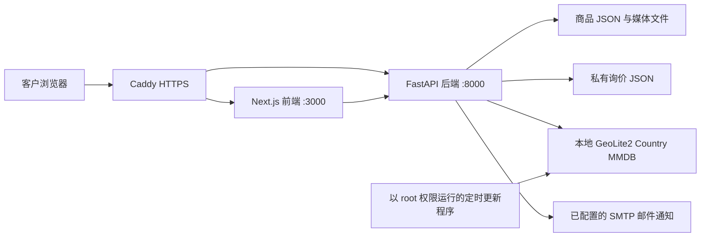
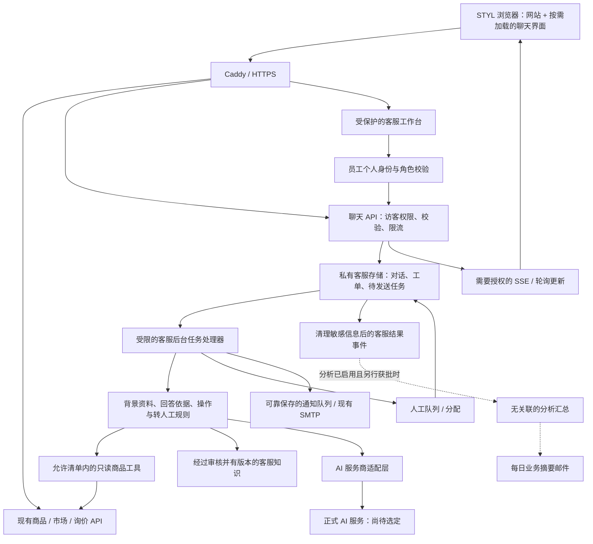
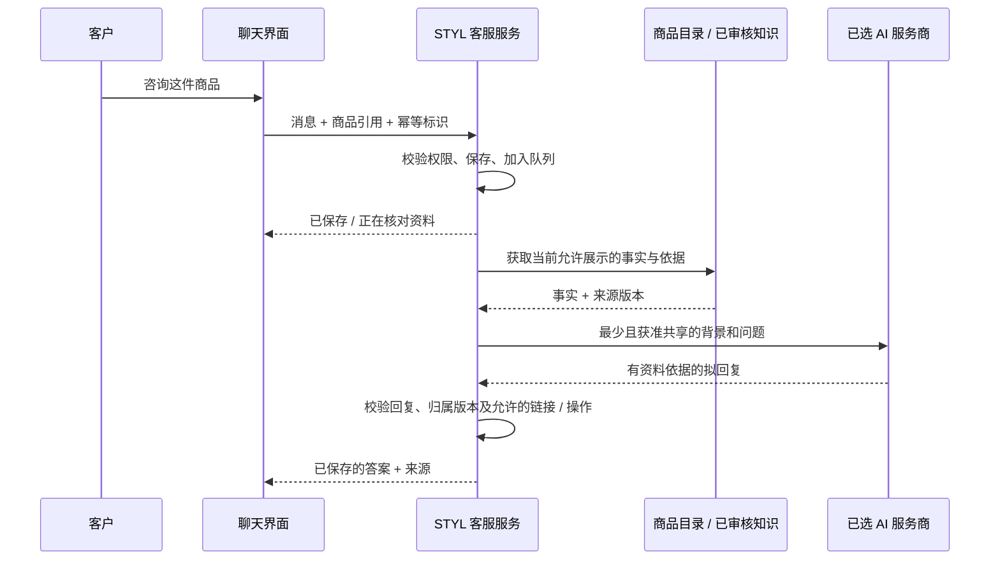

# STYL 网站与 AI 辅助客户服务架构

状态：供评审的架构与用户体验设计草稿。本文件不代表授权开发聊天功能、
选定服务商、购买服务、传输数据或进行部署。

原稿日期：2026-09-28

中文译本日期：2026-09-28

英文原稿：[STYL Website and AI-Assisted Customer-Service Architecture](customer-service-ai-architecture.md)

原稿记录的当前代码基线：`d874a8e`。
已部署的 GeoIP／数据来源署名功能基线：`bc45b22`，以及后续的运维说明文档。

**阅读说明：** 本文件是完整简体中文副本，不是摘要。
为方便只有基础英语的读者理解，技术术语尽量用中文解释；
产品名称、接口路径、状态代码和验收编号保持不变，便于与开发工作对照。
所有“建议”“候选”“待确认”事项仍需评审，不代表已经实现。

相关文档：

- [当前 STYL 网站说明](../README.md)
- [网站流量分析与每日邮件需求（中文版）](traffic-analytics-requirements.zh-CN.md)
- [当前响应式用户体验设计](mobile-ux-design.md)
- [未来商品目录／管理后台数据模型](catalog-and-admin-schema-design.md)
- [服务器托管与部署](lightsail-deployment.md)
- [国家识别与价格市场选择](geoip-pricing.md)
- [持续维护的回归测试计划](regression-test-plan.md)

## 1. 总体建议

为 STYL 增加由网站自己提供的客户聊天界面，后台由服务器控制客服流程。
通过一层 **AI 服务商适配层（Provider adapter）** 接入 AI，
这样在完成评估前，不必把整个系统绑定到 MUSE、CoWork 或其他某一个候选产品。

AI 应使用经过批准的 STYL 资料和当前公开商品信息回答常见问题。
资料不足时不能猜测。**可靠保存的人工客服队列应当属于第一版面向客户的功能**，
不能等 AI 回答失败后，再临时考虑如何联系人工。

建议实施顺序：

1. 先确定客服规则、经过审核的知识资料，以及人工负责人的职责。
2. 建立可靠的人工联系／转接流程，并为工作人员提供个人账号。
3. 在功能开关控制下，增加只读、回答有资料依据的 AI 助手。
4. 先小范围试用，评估回答质量、转人工和隐私，再扩大使用。
5. 将客服结果的汇总数据接入未来的分析后台和每日邮件，
   但不要把聊天原文复制到流量分析系统中。

即使聊天功能、AI 服务商或客服数据库不可用，
现有商品目录、价格、购物车和询价流程也必须继续工作。
不要在当前较小的 Lightsail 服务器上运行大型语言模型，
也不要让正式网站聊天依赖 VS Code 一直打开、桌面自动操作，或某个人保持登录。

## 2. 范围与决策

### 用户已经确认的方向

- 希望在近期增加即时聊天，回答客户问题。
- 通常由 AI 回答；AI 缺少足够背景资料时转交人工。
- 服务提供商尚未确定，提到的候选名称包括 MUSE 和 CoWork。
- 架构文档需要包含当前网站、用户体验、工作前提和整体设计。

### 建议的首版范围

- 在公开的桌面／手机页面提供文字聊天，并明确标为 AI 辅助。
- 支持围绕某件商品、一般业务政策，以及客户选择共享的购物车内容提问。
- 检索经过批准的常见问题／政策，并通过只读工具获取当前公开商品资料。
- 支持转人工、离线跟进、客服工作台、任务分配和通知。
- 支持恢复对话、防滥用、控制成本、隐私告知和数据保留。
- 提供基本客服运行／质量指标，并可选择接入汇总分析。

### 首版不包含的内容

- 让 AI 修改商品目录、价格、发布状态、库存或兼容性信息。
- 自主批准折扣、正式约束性报价、购买、退款或付款处理。
- 在没有单独设计身份验证流程的情况下，查询客户订单／账号。
- 随意打开客户提供的网址，或自主操作桌面。
- 客户上传图片／文件、语音、社交平台聊天或屏幕共享。
- 不受限制的训练／医疗／康复建议，或没有依据的承重／适配结论。
- 自动把每次聊天或人工回复都用于学习。
- 把更换整个商品数据模型或完成流量分析项目，作为上线客服的必需前提。

文中的服务时间、预算、保留期限和性能限制都是**需要评审的建议默认值**，
不是 STYL 当前已经对外承诺的服务水平。

## 3. 当前 STYL：已经具备什么

| 组成部分 | 当前能力 | 对聊天功能的影响 |
| --- | --- | --- |
| Next.js／React／TypeScript 前端 | 首页／商品列表、配件、商品详情、购物车、询价表单和管理后台 | 增加公共页面共用的聊天入口，但不能破坏现有浏览和询价流程 |
| FastAPI 后端 | 公开商品／市场／选择清单接口、受保护的后台修改、上传和询价接收 | 复用现有业务校验；不要把管理员凭据放进 AI 工具 |
| 商品持久化存储 | 产品和配件分别存为 JSON，上传媒体保存在磁盘 | 使用现有“商品类型 + 不可变 ID”进行关联，不依赖未来全局 SKU |
| 定价／发布 | CAD 与 USD 独立设置，按国家选择市场；缺少当地价格和草稿商品不展示 | AI 也必须遵守相同的可见性和价格规则 |
| GeoIP 国家识别 | 本地 Country MMDB 数据库，正式环境定时更新 | 只传递必要的国家／币种背景，不传原始 IP，也不推断配送地址 |
| 购物车 | 浏览器本地保存商品／数量，并根据当前目录重新核对 | 只有客户明确选择共享，且服务器重新校验后，才能提供给聊天 |
| 询价 | 先保存询价 JSON，再发送 SMTP 邮件；回复地址是客户邮箱 | 现有询价接口不等于客服对话、客服工作台，也不等于送达／已读回执 |
| 后台访问 | 使用共享 Bearer Token（持有令牌即可访问） | 不足以支持可追责的多人客服；需要个人身份和角色权限 |
| 服务器 | 一台 AWS Lightsail Ubuntu；Caddy 提供 HTTPS；前端 3000、API 8000 只监听本机 | 先采用小规模设计，隔离 AI 工作、限制负载，避免影响网站响应 |
| 流量分析 | 已批准替换为匿名汇总；本地实现／验证正在进行，未部署；真实日报关闭 | 未来客服只能提供可选的无关联汇总次数，流量分析中不包含浏览器／会话／对话关联 |
| AI／在线客服 | 尚未实现 | 尚无选定的服务商、整理好的 AI 知识库、队列、排班或在线客服服务水平约定 |

当前代码参考：
[API 与询价处理](../backend/app/main.py)、
[国家识别](../backend/app/location.py)、
[网站根布局](../frontend/src/app/layout.tsx)、
[顶部导航](../frontend/src/components/StoreHeader.tsx)、
[购物车逻辑](../frontend/src/lib/useCart.ts)。

### 当前部署示意图



这是逻辑示意图。正式环境中，浏览器 API 请求通过网站同源地址转发。
不能为了增加聊天功能，就把服务器的 3000／8000 端口向公网开放。

## 4. 前提条件与上线前检查

“检查关卡（Gate）”表示：进入下一阶段前，必须有人负责并完成相应准备。

| 编号／关卡 | 哪个阶段之前必须完成 | 负责人／资料要求与完成标准 |
| --- | --- | --- |
| PR-01：客服范围 | AI 试用之前 | 业务负责人批准可回答的话题、禁止作出的承诺、转人工原因和初始支持语言 |
| PR-02：人工服务 | 公开聊天上线之前 | 明确具体人员、服务时间／时区／节假日、替补安排、队列负责人，以及能做到的响应目标 |
| PR-03：知识资料准备 | AI 开始回答之前 | 审核商品事实、兼容性证据、配送／安装／保修／退货常见问题，并记录负责人、版本和生效日期 |
| PR-04：服务商资格 | 任何外部 AI 请求之前 | 确认准确产品／服务商；评估正式 API／SDK、数据处理条款、保留／训练设置、地区、删除和成本 |
| PR-05：隐私与同意 | 收集聊天之前 | 批准客户告知内容、数据处理依据／同意方式、聊天及联系方式保留期、与人工／服务商共享方式及删除流程 |
| PR-06：员工身份 | 人工工作台启用之前 | 个人登录、操作权限、审计记录和撤销访问能力；不能把共享商品管理令牌当成客服个人账号 |
| PR-07：可靠存储 | 转人工试用之前 | 对话、负责人、工单状态和通知能在重启后保留；备份／恢复和删除经过测试 |
| PR-08：运维准备 | 正式推广之前 | 验证凭据保护、调用／成本限制、监控、备用流程、功能开关、回退和操作手册 |
| PR-09：评估问题集 | AI 试用之前 | 负责人审核常见问题、资料缺失／矛盾示例，以及不安全或索取私有数据的问题，给出期望结果 |
| PR-10：客户备用渠道 | 任何公开版本之前 | 即使 AI、消息连接或聊天组件失效，客户仍能找到可用的人工／离线联系渠道 |

重要但尚未明确的业务信息，不能交给模型自行编造。
需要准备的例子包括：配送范围、货运／安装流程、交付周期政策、退货、
保修适用条件、组装说明／手册链接、客服联系方式、营业时间，
以及具体型号适配和承重说法的证据。

有一个接收通知的邮箱，并不代表有人实时值守。
没有人工在线时，应以“**AI 帮助 + 联系团队**”的方式提供服务，
不能承诺随时能够与真人即时聊天。

## 5. 未来整体架构



### 各部分的职责

- **聊天界面（Chat UI）：** 显示消息和状态，接收客户主动输入及选择共享的背景，
  恢复有权限访问的对话，提供转人工和询价入口。
- **聊天 API：** 负责身份验证、对话访问、重复请求去重、当前市场判断、
  消息校验、可靠保存状态，以及只向有权限的对象发送事件。
- **客服后台任务处理器（Support worker）：**
  在商品请求流程之外，按限制调用 AI 服务。
  等待模型或网络时，不能一直占着数据库事务。
- **资料依据／业务规则层：** 选择经过批准的证据，限制工具能力，
  校验回答和操作格式，决定何时追问、何时转人工。
- **AI 服务商适配层：** 隔离不同服务商的 SDK、模型／版本配置、
  超时、取消、用量和错误格式。业务规则不交给服务商适配层决定。
- **知识存储：** 保存经过审核的业务文档及其发布信息，
  不把任意代码仓库文件或客户聊天记录混入其中。
- **客服工作台：** 处理分配、完整且获准查看的背景、人工回复、转接状态和员工审计。
  不依赖网站负责人保持这段开发对话打开。
- **通知任务处理器：** 可靠保存通知和发送状态；
  邮件失败不能导致人工工单丢失。
- **分析适配层：** 只发送允许的计数和结果。
  关闭分析接入时，客服本身仍须正常工作。

### 初期基础设施建议

保留当前前端、API 和商品 JSON。
另外增加一个私有 SQLite 客服数据库，使用事务、唯一性约束、
能够正确处理 WAL 的备份方式，以及有时限的数据库锁等待。

一个轻量、独立的后台处理器，可以使用该数据库中可靠保存的任务／待发送表。
首版不强制要求 Redis、向量检索服务或新的托管数据库。

模型推理由**获得批准的外部正式 AI API** 完成。
当前 1 GB Lightsail 服务器不用于托管大模型。
如果常见问题资料规模较小，初期优先使用整理后的文本搜索或 SQLite 全文搜索；
只有评估表明确有需要时，再引入 Embedding（文本向量）和向量检索。

限制后台任务的并发量和队列长度，并在网站承受访问负载时测量内存、CPU 和延迟。
当测量结果表明确有需要，再把任务处理器／存储迁到独立基础设施。
不能因为增加聊天，就顺便让多个 API 进程或多台服务器同时写当前的 JSON 商品目录。

## 6. 有依据的回答与 AI 安全行为

这里的 **Grounding**，指让回答基于可核实、已批准的资料，
而不是仅靠模型“觉得应该如此”。

### 知识来源与信任边界

| 来源 | 可以用来做什么 | 限制 |
| --- | --- | --- |
| 当前公开商品／市场服务 | 获取价格、销售单位、已发布规格、当前可展示商品 | 读取结构化的最新事实；每轮对话都执行当前市场与发布规则 |
| 已批准的 STYL 常见问题／政策／手册节选 | 一般服务和商品说明 | 必须已发布、有版本、适用、审核过且未过期；回答引用对应来源 |
| 客户明确输入的聊天内容 | 理解问题和客户提出的要求 | 视为不可信的数据，不能当成越过规则或获取高级工具权限的命令 |
| 客户共享的商品／购物车引用 | 理解问题背景 | 服务器重新查商品 ID 和价格；不信任浏览器提交的价格／状态 |
| 仅员工可见的客服备注 | 供获得授权的人工处理问题 | 除非单独审核并发布，否则不进入面向客户的 AI 检索 |
| 私有商品来源、凭据、后台文件、其他客户询价 | 不使用 | 不建立索引，也不传给模型 |
| 任意外部网址或上传文档 | 首版不使用 | 不按照客户消息中的指令，自主抓取或导入这些内容 |

RAG（检索增强生成）是先找出获准使用的资料，再据此组织回答。
**使用 RAG 并不能保证模型一定正确。**
检索到的文字也可能夹带恶意指令。
因此，客户文字和检索文字都应当被当成数据；
工具权限由服务器限制，输出也要独立校验，不能只靠提示词约束。

### 如何决定回答、追问或转人工

1. 理解客户问题，以及明确提供的商品／背景引用。
2. 获取当前市场允许展示的公开事实和适用知识。
3. 问题不明确时，简短追问。建议最多进行两轮仍未解决问题的澄清，然后转人工。
4. 资料缺失、过期、互相矛盾、超出范围，或不足以支持安全回答时，
   说明缺口并进入人工备用流程。
5. 资料足够时，生成简短、带来源链接／标识的回答，
   并在发布前校验商品引用、金额、币种和允许的操作。

不能仅凭模型自己说“我有多少把握”来决定是否转人工。
应结合资料是否充分、问题风险、工具结果，以及经过评估的判断阈值。

### 不可违反的业务规则

- 不编造库存、到货时间、安装覆盖范围、折扣、保修资格、认证，
  或最终运费／税额。
- 展示价格以当前商品目录为准。
  缓存的向量资料或以前的聊天内容不能覆盖新价格；CAD 与 USD 保持独立。
- 当前市场不可见的商品或草稿商品，不能通过聊天搜索、比较、
  引用、推荐或工具结果泄露出来。
- 不能根据分类或标称尺寸推断兼容性。
  **75 mm 并不等于 3 英寸（76.2 mm）**。
  对具体型号的适配／承重缺少证据时，应交给团队确认，不能自信地猜测。
- 询价只是请求，不是购买，也不代表有约束力的正式报价。
  引导客户使用现有询价流程，提交前让客户检查拟提交的内容。
- 面向客户的 AI 不具备管理员令牌、生产服务器命令行、
  通用 SQL、任意 HTTP 请求、付款、商品修改或客户记录搜索工具。
- 模型可以提出转人工建议，但是否允许以及如何保存，由应用规则负责。
- 人工更正应先成为待审核的知识草稿，
  不能自动发布为训练资料，也不能直接成为不同客户之间共享的记忆。

首版可以在准备答案时发送进度／状态提示，
但应先缓存在后台，**完整校验答案后再一次发布**。
逐个生成片段实时显示（Token streaming）可以以后再加；
不能先向客户显示未校验的价格或危险结论，再寄希望于事后撤回。

## 7. 转人工与对话归属

“对话归属”指当前究竟由 AI 还是哪一位人工客服负责回答。
同一段对话不能出现双方互相抢答或重复回复。

### 转人工的触发条件

- 客户随时明确要求与真人交流。
- 资料不够、矛盾、过期，或问题不在支持范围内。
- 需要确认具体兼容性、承重、保修或例外情况。
- 需要商务谈判、定制配送或其他具有约束力的决定。
- 多次误解客户、收到负面反馈，或 AI 服务／工具发生故障。
- 需要处理滥用／安全问题，或话题超出批准的客服范围。

最初的告知内容应清楚说明：这里有 AI 辅助，STYL 团队可能查看对话。
最终隐私设计需要确定，转交聊天记录前什么时候还要获得额外确认，
尤其是转给外部客服平台时。

### 状态模型

英文状态代码保留供系统使用，中文说明用于业务理解。

| 状态 | 客户看到什么 | 谁可以回答 |
| --- | --- | --- |
| `ai_active`：AI 处理中 | 明确的 AI 助手标识，以及有资料依据的回答 | 通过受规则控制的后台任务运行的 AI |
| `handoff_requested`：正在提交人工请求 | 请求正在保存 | AI 只能确认收到／正在处理，不能继续猜测性回答 |
| `queued`：已进入队列 | 请求已保存，并说明有无人工在线或是否离线跟进 | 不再发送新的实质性 AI 回复 |
| `human_active`：人工处理中 | 显示具体 STYL 工作人员已经加入 | 已分配的人工客服 |
| `waiting_customer`：等待客户补充 | 团队需要客户澄清问题 | 对话仍由人工负责 |
| `resolved`：已解决 | 显示解决状态，可选择提供评价 | 明确重新打开前，不产生新回答 |
| `closed`：已关闭 | 在保留期限内可查看的只读历史 | 无人继续回答；新请求／重新打开按规定流程处理 |

AI 服务商故障与对话归属要分别记录。
发生故障时，不能悄悄把已由人工接管的对话切回 AI。

### 转接要求

- 工单可靠保存成功后，才能显示“您的请求已保存”。
- 保存原因代码、商品引用、市场、最后一个问题、可用资料来源和获准共享的聊天记录。
  机器生成的摘要必须有标识，不能替代原始对话作为处理依据。
- 分配／领取工单必须通过事务完成。
  不能让两位员工在不知情的情况下同时领取同一段对话。
  记录谁领取、转交、回复和解决了问题。
- 人工接管时，更新对话归属／生成任务的版本号，取消进行中的 AI 工作，
  并通过版本校验阻止旧回复发布。
  **人工接管后，即使 AI 晚一些才返回结果，也不能再把该结果发给客户。**
  这是数据库／服务器规则，不只是把某个前端按钮隐藏。
- 交还 AI 必须由员工明确操作，并让客户看到提示。
  人工仍负责时，不能采用“过几分钟自动让 AI 接着答”的行为。
- 是否有人在线，要同时看排班时间、已分配任务／可用容量和近期员工在线状态更新。
  只设置了一张时间表，并不能证明“现在有人在线”。
- 没有人值守时，应如实说明团队离线，并提供后续联系。
  只有需要时才索取联系方式；展示已设置的响应目标，
  不编造精确等待时间，也不保证立即服务。
- 关闭浏览器不能删除已经保存的队列工单。
  提供需要授权的恢复方式；邮件跟进与浏览器内消息送达回执是不同的事情。

如果客服数据库无法保存转人工请求，应明确说**没有保存成功**，
并显示原有联系／询价入口。
邮件服务器接受通知、工单创建、人工分配、人工实际回复，是四种不同状态。

## 8. 客户体验设计（UX）

### 聊天入口与商品相关入口

- 使用一个小而明确的 **Ask STYL（咨询 STYL）** 入口，
  不要自动弹出打扰客户的大窗口。
  不主动伪造“客服正在输入”，也不要反复发出吸引注意的声音。
- 在商品详情页增加“咨询这件商品”。
  商品卡片是否也加入口，先评审布局。
  传递商品类型／ID，不传整个网页 DOM 内容。
- 购物车中可提供“咨询我的选择清单”，并明确让客户执行共享清单操作。
  不能暗中读取浏览器存储或询价字段并送入聊天。
- 在聊天里用可以移除的小标签显示当前商品／市场背景。
  更换商品或离开页面时，不能悄悄替换客户当前问题的背景。
- 主要的购物／询价操作仍应在视觉上更突出，聊天不能喧宾夺主。

### 桌面端示意图

```text
商品列表／详情页面                 +--------------------------------------+
                                  | Ask STYL（咨询 STYL）           [-] |
原有详情和操作仍然可以使用          | AI 助手             联系人工团队     |
                                  | 咨询商品：[已选商品 ×]               |
                                  | 当前价格币种：USD                   |
                                  |--------------------------------------|
                                  | 客户的问题                          |
                                  | AI 回答，并附资料来源链接           |
                                  | [查看商品]       [申请报价]          |
                                  |--------------------------------------|
                                  | 输入消息……                  [发送]  |
                                  | AI 可能出错。             隐私说明  |
                                  +--------------------------------------+
```

建议宽度为 360—420 CSS 像素，同时根据可用空间限制最大宽度；
高度不超过当前屏幕可见范围。
聊天面板不能盖住正在填写的询价表单或重要购物车按钮。
允许最小化／关闭，但不能丢失已经保存的对话。

### 手机端示意图与遮挡处理

```text
+--------------------------------------+
| 返回       咨询 STYL            关闭 |
| AI 助手／STYL 工作人员               |
| [商品背景] [USD]                     |
|--------------------------------------|
| 历史消息                             |
| 有依据的回答／人工处理状态           |
|                                      |
|--------------------------------------|
| 输入消息……                    发送   |
| 隐私说明／备用联系渠道               |
+--------------------------------------+
```

- 窄屏手机使用接近全屏的面板或独立客服页面，
  不要把桌面面板机械地缩小。
  适配屏幕可见高度变化和安全边距，例如刘海及底部手势区域。
- 手机软键盘不能盖住输入框或发送按钮；关闭／返回按钮必须容易找到。
  浏览器返回操作应先关闭聊天面板，避免意外离开购物流程。
- 聊天入口可以放在现有固定购物车／商品操作栏上方，
  或在空间不够时，移到不遮挡内容的顶部／菜单位置。
  不能把 Add to cart（加入购物车）、Request a quote（申请报价）
  或 Submit inquiry（提交询价）盖在聊天后面。
- 明确聊天、导航菜单和放大媒体窗口之间的层级。
  同一时间只允许一个弹窗控制键盘焦点，
  不能打开图库／菜单后出现两个互相限制焦点的窗口。
- 关闭聊天后保留原有页面滚动位置、所选媒体、购物车和询价输入。
  不能重新引入已经修复的询价跳转闪动。

### 交互状态与无障碍支持

- 界面需要区分：已关闭、连接中、就绪、等待答案、答案可用、
  转人工保存中／排队中、人工已加入、离线、重新连接、失败和已解决。
- Enter 发送，Shift+Enter 换行。
  支持中文等输入法正在选词的状态（IME composition）、触摸、
  屏幕阅读器、键盘、大字号和减少动画的偏好。
- 屏幕阅读器应以不打断用户的方式宣布完整新消息／状态，
  不要每生成一个片段都朗读一次。
  焦点移动要可预期，关闭后回到聊天入口。
- 可恢复故障发生时，保留未发送文字；重试使用同一个幂等标识。
  区分“本地已输入”“服务器已保存”“已送达对方”。
- 只有用户已经在消息列表底部附近时，才自动滚动到新消息。
  用户正在读旧消息时，显示“有新消息”提示，不要强行拉回底部。
- 按钮／链接要有可见标签，点击区域至少 44 像素，便于触摸操作。
- 资料来源和引用内容以清理过的文字／受限 Markdown 显示；
  禁止可执行 HTML、脚本、远程嵌入和未批准的网址。
- 不能把 AI 标成真人。人工加入时，更改标题栏并展示批准使用的客服显示名称。
  始终保留“联系人工团队”的入口。

资料不足时的回复示例：

> 根据现有资料，我还不能确认这个配件是否适合您的具体型号。
> 我可以请 STYL 团队帮您核对。请提供架子的型号；
> 我不会直接把 75 mm 和 3 英寸立柱当成可以互换的规格。

### 与询价流程的连接

首版优先提供明确的 **Request a quote（申请报价）** 操作，
打开现有表单，并给出客户可以检查的摘要。
共享聊天节选或联系方式，必须经过批准的隐私流程。
表单继续使用现有询价 API 保存，原有失败处理方式保持不变。

不能因为聊天推荐客户询价，或创建了客服工单，
就把询价标为“已经收到”。
只有真实询价保存成功后，才能保存可选的客服／询价关联，
并通过幂等处理避免重复，同时兼容原有询价客户端。

## 9. 数据与 API 设计

### 建议的数据记录

| 记录 | 重要字段／必须保持的规则 |
| --- | --- |
| 对话（Conversation） | 不直接暴露内部业务含义的 ID、访问范围、状态、市场、创建／更新时间、保留到期时间、归属版本 |
| 参与者／访客权限 | 绑定的访客会话或员工个人 ID／角色；到期／撤销规则；不通过 IP 推断身份 |
| 消息（Message） | ID、对话 ID、发送者类型、顺序号、客户端幂等标识、正文、保存时间、回复／生成任务版本 |
| 背景快照 | 经服务器校验的商品引用、币种、客户明确共享的可选购物车；不把浏览器提供的价格当作权威 |
| 证据／知识文档 | 已批准内容、负责人、版本、发布／生效／过期状态、适用范围、来源链接 |
| AI 执行记录 | 服务商／模型／规则版本、资料引用、状态、延迟、用量／成本和清理后的错误；不含凭据 |
| 转人工工单 | 原因、状态、优先级、负责人、时间、获准使用的联系信息引用和对话链接 |
| 通知／待发送任务 | 唯一发送标识、目的地类别、尝试／状态、安全错误信息和下次重试时间 |
| 员工审计 | 操作者、操作、对象和时间；限制保留期与访问权限 |
| 客服结果 | 私有客服记录中的固定话题／原因／结果代码；只有另行获准的无关联汇总可进入流量分析，不含对话／客户关联 ID |

对话状态、领取责任、消息及待发送任务保存，都需要事务。
不要把它们实现为彼此独立、分别覆盖写入的 JSON 文件。

客服内容和可选联系方式属于私有数据，
不能放在公开商品上传目录下，也不能由公开商品接口返回。

### 建议的接口，不是目前已有接口

- `POST /api/support/conversations`：建立／恢复有权限的访客对话范围。
- `POST /api/support/conversations/{id}/messages`：
  带幂等标识校验、保存消息；加入处理队列，并返回已接收的消息 ID／状态。
- `GET /api/support/conversations/{id}/events`：
  通过需要授权的 SSE 或增量轮询获取更新，使用有序游标恢复，
  避免重复显示消息。
- `POST /api/support/conversations/{id}/handoff`：保存转人工请求。
- `POST /api/support/conversations/{id}/close`：按规则关闭对话。
- 为员工提供受保护的队列、领取、回复、转交、解决和知识发布接口；
  每个接口都检查个人角色及对话归属。

**知道对话 ID，不代表有权访问。**
每次读取、写入和消息连接，都要绑定到相应客户的访客权限，
或有权限的员工会话。
使用安全的同源会话处理，以及适用的 CSRF（跨站请求伪造）／来源保护、
过期和撤销机制。

不要把对话访问令牌放进公开网址、分析数据或日志。
跨设备／通过邮件恢复对话，需要单独设计经过验证且有有效期的访问流程。

初期采用 HTTP POST 发送请求，通过带授权的 fetch／SSE 接收持续更新，
并提供次数或时间受限的轮询备用方式。
如果选定的人工聊天产品确实需要，再考虑 WebSocket。
Caddy 的流式传输、超时和重连必须测试，
不能假设现有反向代理配置已经适合长期保持的聊天连接。

## 10. 典型完整流程

### A. 有资料可回答的商品问题



### B. 资料不足／转人工

1. 客服规则识别出证据不足，或客户明确要求真人。
2. AI 承认无法确认，不用猜测性的答案替代。
3. 保存人工工单，保留获准共享的背景和转接原因。
4. 根据真实人员状态，显示排队／在线／离线。
5. 员工以不可被并发领取打断的方式接单，
   同时取消并阻止尚未完成的 AI 回复。
6. 客户看到人工加入。如果团队离线，只在需要时收集后续联系方式，
   并说明已批准的响应目标。
7. 保存并审计人工回复／处理结果。
   如需把这次经验补充为知识，必须另走审批流程。

### C. AI 服务商或网络故障

已经保存的消息继续可靠保留。
有限重试不能产生重复消息／工单，也不能重复执行会改变业务结果的操作。

AI 服务超时、成本达到预算或服务不可用时，提供人工／离线支持。
浏览器断线后，从有权限访问的事件游标位置恢复。
如果存储本身失败，应显示“未发送／未保存”和原有联系入口，
而不是假装成功。

## 11. 隐私、安全与外部服务边界

- 客户聊天属于客户服务用途，与只做匿名汇总的流量统计分开。
  聊天告知、处理依据／同意、服务商共享和保留期限仍须另行批准。
  流量统计只在 aggregate-only 配置已启用、没有退出／排除项时自动开始；
  普通 Privacy 页面提供退出方式，前台不显示同意面板或技术状态。
  退出分析不能妨碍基本客服，也不能利用聊天偷偷替代行为追踪。
- 在外部 AI／客服服务商及数据共享范围获批之前，
  不向它们发送真实聊天记录、联系方式或私有业务数据。
  本地测试使用虚构消息和模拟服务商。
- 只给模型发送最少且已批准的对话／背景。
  回答不需要联系方式时，不把联系方式放入模型请求。
- AI 服务商和 SMTP 凭据只保存在服务器端，
  不进入浏览器、提示词、截图、代码仓库或诊断输出。
  使用最低必要权限的密钥，并记录更换／撤销流程。
- 对消息、消息连接、导出、员工备注和恢复功能都做权限检查。
  不只测登录页面，还要测试能否越权访问其他对话或绕过角色权限。
- 工具及参数使用允许清单，设置超时、频率限制和输出上限。
  模型不能自行批准自己的写入／工具权限。
- 用户、服务商和员工提交的内容都要在显示前校验。
  检索资料中的指令，不能导致系统任意访问网址、读取凭据或泄露数据。
- 分级防滥用措施应保护可用性和成本，默认不保存原始 IP 历史。
  如果安全日志确实需要 IP，按分析需求说明独立用途、限制访问和保留期。
  现有基础设施日志及业务联系方式可能包含个人数据；
  匿名汇总流量统计不代表整个网站都没有个人数据。
- 待评审的建议保留期限：
  对话关闭后保留聊天内容／联系方式关联 30 天，
  运维／审计信息保留 90 天，
  汇总结果按已批准的分析规则处理。
  法律或业务记录需要可能要求不同政策。
- 删除流程应覆盖服务商支持删除的副本、本地内容、由内容生成的向量、
  导出和备份过期／恢复处理。
  服务商能否删除数据是选型关卡，不能当作未经核实的承诺。

附件功能推迟到以后。
增加时需要私有存储、文件类型／大小校验、恶意文件处理、
去除不必要元数据、访问到期控制，并单独决定是否允许 AI 处理附件。

## 12. 与分析及每日邮件的连接

遵循[流量分析需求](traffic-analytics-requirements.zh-CN.md)：
自动第一方匿名汇总、Privacy 页面退出、保留历史拒绝、
排除规则、独立概略维度和保留期限。
分析不可用或客户已退出时，聊天仍必须可用。
这不取消未来聊天单独的告知／同意／服务商批准关卡。

建议的安全事件：
`chat_open`（打开聊天）、
`chat_started`（开始对话）、
`ai_answer_completed`（AI 回答完成）、
`handoff_requested`（申请人工）、
`handoff_claimed`（人工接单）、
`human_first_reply`（人工首次回复）、
`chat_resolved`（问题已解决）、
`chat_feedback`（客户反馈）、
`chat_to_inquiry`（聊天关联到询价）。

这些是未来私有客服领域的信号，不代表允许把原始事件发送到流量分析。
只能导出获准的无关联小时／类别总数、有上限的时长总和／次数、
服务商用量／成本汇总。
流量分析中**不包含对话、客户、浏览器、会话、事件或页面浏览关联 ID，
精确事件／请求时间、消息正文、邮箱／电话、原始 IP 或客户输入的邮编**。
不保存组合维度，也不从这些总数重建个人浏览过程。

每日汇总可增加：

- 新对话数、人工请求数、尚未解决的队列数量。
- AI 响应耗时／失败、转人工原因、人工首次响应时间。
- 客户评价的帮助程度，以及明确确认解决的问题。
- 只有私有客服／询价关联单独获批时，才提供聊天辅助的已保存询价业务总数；
  只导出无关联计数，不导出关系本身或流量会话转化率。
- 经常出现、但资料不足的**已批准话题类别**。
- 服务商用量／成本和服务质量警告。

不能把“没有转人工”直接叫作“AI 已解决问题”。
“没有转人工的比例”和“确认解决的比例”要分别报告；
客户中途离开的聊天，结果应记为未知。

与聊天关联的询价只是相关关系，不证明 AI 导致了转化。
转人工工单也不能直接算作销售线索／询价，
除非符合单独定义的业务记录条件。

每日邮件只放汇总数据；已批准时间仍为太平洋时间 08:00，
预览排除当前尚未结束的小时。
流量访客／会话数、中位数、个人路径和按会话的来源关联仍不可用。
不要邮件发送完整聊天记录，也不要只是为了生成日报，
就把聊天记录交给外部摘要 AI。
默认使用基于规则的观察结论。
人工个案通知与每日业务摘要，要分开配置收件人和用途。

城市／ZIP 分析仍是**第二阶段 / P2**。
它不是聊天功能的依赖，也不能用于推断客户配送地址或真实身份。

## 13. AI 服务商／平台选型

MUSE、CoWork 是用户提出的候选名称，
并不代表已经选定，也不代表已经核实它们具有某种能力。
比较前，先确认准确产品名称／网址，以及计划使用的商业服务版本。

没有受支持的正式 API 的个人桌面助手，
并不天然适合接入面向公众的网站。

| 评估方面 | 必须获得的证据 |
| --- | --- |
| 接入方式 | 受支持的服务器 API／SDK、服务身份验证、部署条款；不依靠抓取或自动操作个人界面 |
| 回答依据 | 支持结构化工具／背景、来源引用、输出校验，以及可预期的资料不足处理 |
| 人工支持 | 原生或可集成的客服工作台、Webhook／事件、任务分配、身份和接管／取消机制 |
| 隐私 | 数据保留／训练设置、处理地区及分包处理商、删除／导出、合同审查、最少背景控制 |
| 可靠性 | 超时、取消、限流、消息流／恢复、中断处理和可观察的错误 |
| 成本 | 输入／输出／工具费用、可能的客服席位费用、预算控制、提醒和用量导出 |
| 可迁移性 | 可导出对话／知识，ID 与业务规则由 STYL 掌握，稳定的适配接口，以及迁移／退出方案 |
| 质量 | 在需要的语言和风险话题上，通过 STYL 整理的评估问题集 |

可以考虑三种实现方式：

1. **自有界面 + STYL 流程控制 + AI API + 自建人工工作台：**
   控制力最强，但 STYL 需要开发和维护人工工作台／队列。
2. **带 AI 与人工客服的托管平台：**
   可能更快建立人员处理流程，但需要核实接口、隐私、价格和导出能力。
3. **混合方式：**
   网站体验和商品业务工具由 STYL 控制，
   选定的平台提供人工工作台和模型集成。

建议默认保留**自有用户体验以及业务／规则控制权**，
再根据实际证据决定人工工作台和 AI 服务商。
不要同时把三种方式都开发一遍。

适配层应支持提交／取消、回答／状态、资料／工具结果、
用量和统一的错误格式；不要把项目扩展成一个通用智能体平台。

## 14. 运行管理、预算与上线关卡

建议先在试用中验证以下限制：

- 客户单条消息最多 4,000 个字符。
- 每个对话同一时间只处理一轮 AI 回答。
  初期客服处理器最多同时进行两次服务商调用，队列长度也要设上限。
- 在预计负载下，消息保存后 1 秒内给出确认；
  目标是 95% 的请求在 15 秒内给出经过校验的答案（p95 目标），
  服务商调用最长等待 30 秒。
  这些是测试目标，测量验证前不能当作对外承诺。
- 上线前由负责人明确每个会话和每天的 AI 成本预算。
  按调用、Token、工具用量和实际服务商价格估算，不臆测单价。
- 聊天代码只在需要时加载。
  将网站 LCP／INP／CLS、内存和 CPU 与现有基准比较；
  聊天不能拖慢或破坏购物车／询价流程。

功能控制开关包括：
聊天是否启用、AI 是否启用、人工实时模式、离线跟进、
是否发送分析事件，以及允许的工具／话题范围。
AI 被关闭或预算用完时，保留人工／离线支持，不能把备用渠道一起隐藏。

监控 API、处理器和任务健康状态，队列长度／等待时长，
最久无人接单的工单，服务商延迟／错误／成本，
过期知识、消息送达及通知结果。

警报必须有负责人和备用通知方式。
SMTP 故障时，不能只靠同一条失效邮件通道报告故障。

恢复测试应覆盖访客权限、员工归属、消息顺序、
待处理人工请求和通知去重。
恢复或部署不能让已删除对话重新出现，也不能重新发送旧 AI 回复。
现有间歇性 WebKit／预加载问题，应作为已知基线问题继续测试，
不能声称增加聊天后它们就被解决了。

## 15. 分阶段交付

| 阶段 | 交付内容 | 完成条件 |
| --- | --- | --- |
| 0：调研／准备 | 确认准确服务商、客服范围／时间、知识、隐私、预算和 UX | PR-01 至 PR-10 都有负责人；明确阻碍上线的事项 |
| 1：人工客服基础 | 访客对话、员工个人身份、队列、离线跟进、通知和恢复 | 不依赖 AI，客户也能联系到负责的人工；保存和隐私已验证 |
| 2：有依据的 AI 试用 | 只读商品／知识回答，功能开关下可靠转人工 | 评估关卡、归属版本控制、故障和成本限制通过；内部／小范围试用获批 |
| 3：受控公开上线 | 桌面／手机聊天界面、监控、反馈和运维手册 | 人工值守／备用渠道就绪，限量上线和回退经过验证 |
| 4：业务分析／扩展 | 获批的汇总分析／每日邮件，可选语言／媒体／CRM | 每项功能单独决策，审查隐私和容量；不扩张为自主交易系统 |

分析系统可以单独推进；它准备好之前，使用不实际发送分析数据的空适配层。
更大范围的 SKU／商品迁移，以及 City 数据库，都不是聊天上线的依赖。

## 16. 验收与评估用例

以下全部是计划中的用例，**本草稿不代表它们已经通过验证**。

| 用例 | 必须提供的验证证据 |
| --- | --- |
| CS-001 | 对支持范围内的商品／政策问题，使用当前已批准资料回答，并提供有效来源链接 |
| CS-002 | 资料缺失、过期、矛盾或问题模糊时，追问／转人工，而不是编造答案 |
| CS-003 | 加拿大／美国／未知地区正确使用 CAD／USD，遵守草稿和缺少市场价格时的隐藏规则，并保持销售单位明确 |
| CS-004 | 缺少证据的具体型号兼容性／承重问题，包括 75 mm 与 3 英寸的差异，能够安全转人工 |
| CS-005 | 客户任何时候都能要求人工；离线／不可用状态如实显示 |
| CS-006 | 转人工请求先保存再确认；分配不可重复并发领取；能处理同时接单和转交冲突 |
| CS-007 | 人工接管能取消或通过版本校验阻止延迟 AI 任务；接管后包括重连时，不再出现旧 AI 回复 |
| CS-008 | 重试、双击、断线、BFCache 和服务器重启，仍能保持消息顺序，不产生重复消息／工单 |
| CS-009 | 服务商超时／中断／限额，以及数据库／SMTP 失败时，仍有安全备用渠道，不伪造已保存／已送达状态 |
| CS-010 | 不能越权访问其他对话或员工角色；验证访客到期／恢复／撤销，以及 CSRF／来源保护 |
| CS-011 | 提示词注入、恶意资料和输出链接，不能获取秘密／私有草稿或调用未批准工具 |
| CS-012 | 聊天及服务商记录遵守单独批准的告知／同意／保留／删除规则；流量分析只接收获准的无关联汇总，不含聊天正文／联系方式、对话／客户关联 ID 或原始事件时间 |
| CS-013 | 验证桌面和手机 Chromium／WebKit、键盘／输入法／屏幕阅读器、安全区域、大字号和减少动画 |
| CS-014 | 入口／面板不遮挡购物车／询价按钮，不与菜单／媒体弹窗冲突；关闭后恢复焦点、滚动和输入 |
| CS-015 | 客户明确共享的商品／购物车背景准确；导航和进入询价不会暗中提交或修改客户数据 |
| CS-016 | 服务商／模型／来源版本、用量／成本和转人工原因可审计，且不暴露凭据 |
| CS-017 | 固定对话／询价测试数据下，每日客服汇总一致；中途离开不能被算成已解决 |
| CS-018 | 处理器／数据库备份和回退保留归属、通知队列和删除状态，不影响商品／询价可用性 |
| CS-019 | 在实际部署资源上验证负载、消息／队列／成本限制和响应时间，达到批准的试用目标 |
| CS-020 | 每个启用的外部服务商和真实通知通道，都通过明确获批的完整流程测试；受阻的人工／真机检查不能记为通过 |

首版 AI 上线门槛：在经过挑选的关键评估问题集中，
不得出现私有／草稿数据泄露、未授权操作、编造价格／适配承诺，
或人工接管竞争导致的迟到 AI 回复。

报告评估集大小和覆盖范围。
全部通过是有价值的证据，但不能保证模型在任何情况下都正确。
“回答有用程度”和“转人工质量”应分别衡量，
更换服务商／模型前需要负责人评审。

## 17. 接下来需要确定的事项

1. MUSE／CoWork／其他候选的准确产品，以及人工工作台自建还是购买。
2. 支持话题、初始语言、知识负责人和资料证据标准。
3. 谁接人工请求、服务时间／时区、响应目标和替补人员。
4. 员工个人身份验证方式和角色权限。
5. 聊天／联系方式保留期、向服务商共享的范围／处理地区，以及客户告知。
6. 每天／每个会话的 AI 预算和预计并发／访问量。
7. 获批的联系／通知收件人，以及离线恢复对话方式。
8. 桌面面板、手机全屏面板和商品相关入口的设计。
9. 什么时候把客服汇总指标加入单独规划的每日邮件。

建议立即进行的下一步：
**先批准客服范围与人工备用流程，整理知识资料包，
再让准确确定的候选产品回答同一套问题，完成比较后才开始接入开发。**

## 阅读辅助：常用术语

本节只帮助理解，不增加新需求。

| 术语 | 通俗解释 |
| --- | --- |
| Architecture / 架构 | 系统由哪些部分组成、如何通信，以及每部分负责什么 |
| UX / 用户体验 | 客户如何看到、使用和理解功能，包括手机、键盘和无障碍操作 |
| MVP | 首版核心功能：先交付可以可靠使用的一版 |
| Grounding / 有资料依据的回答 | 依据当前、经过批准的信息回答，不只依赖模型自己的推测 |
| RAG | 先检索资料，再让 AI 根据资料组织回答；不是正确性的保证 |
| Provider adapter / 服务商适配层 | 把不同 AI 厂商的接口差异隔开，便于更换服务而不重写业务规则 |
| Worker / 后台任务处理器 | 专门执行较慢任务的程序，避免网站普通请求被 AI 等待时间拖住 |
| Handoff / 转人工 | 将问题和允许共享的背景交给人工团队处理 |
| Ownership / 对话归属 | 当前由谁负责回答：AI 或某个具体人工客服 |
| Fencing / 版本校验阻断旧结果 | 用版本号判断结果是否过期，防止人工接管后旧 AI 回复仍被发送 |
| Idempotency / 幂等 | 重复发送同一请求，也不会重复创建消息、工单或业务结果 |
| Outbox / 待发送任务表 | 先把需要发送的通知可靠保存，再由后台发送并记录结果 |
| Transaction / 事务 | 把相关数据操作作为一个整体完成，避免只成功一部分或同时被重复领取 |
| WAL | 数据库预写日志；备份时要按数据库的正确方式一起处理 |
| SSE / 服务器事件流 | 浏览器通过持续 HTTP 连接接收服务器更新 |
| Polling / 轮询 | 浏览器按一定间隔询问服务器有没有新消息 |
| WebSocket | 一种可持续双向传输消息的连接方式；不代表本项目首版必须使用 |
| Webhook | 某个系统发生事件后，主动通知另一个系统的接口 |
| API / SDK | 系统间调用接口／服务商提供的开发工具包 |
| Embedding / 向量 | 将文字转为可用于相似度检索的数字表示 |
| CSRF | 跨站请求伪造：防止别的网站借用户的登录状态执行未授权操作 |
| IME | 输入法，例如中文拼音输入时先选字再完成输入 |
| p95 | 95% 请求不超过的耗时，用于观察大多数请求的响应表现 |
| LCP / INP / CLS | 页面主要内容加载、交互响应、画面布局稳定性方面的性能指标 |
| SLA | 服务水平约定，例如响应目标；未经过测量和批准前不能随意承诺 |
| Token | AI 处理文字的计量片段，可能影响用量和费用，不一定等于一个字或一个词 |
